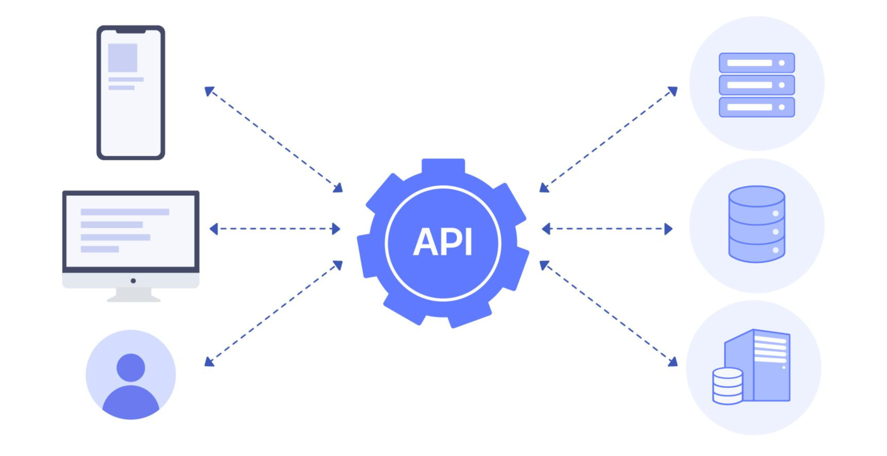

## const와 let
- JS에서 변수를 선언하는 데 사용되는 키워드
- **`const`**
    - 한 번 할당된 값을 **변경할 수 없는 상수**를 선언
- **`let`**
    - <span style="color:green">블록 범위</span> 지역 **변수** 선언
    - 값이 필요에 따라 변경 가능
        - <span style="color:green">블록 범위</span>  : **`{}`** 로 둘러싸인 범위

---

## **Function 사용법**
- ex) ```js```
    ```js
    // 함수 정의
    function functionName(parameter1, parameter2) {
        // 함수 내용
        const result = parameter1 + parameter2;
        return result; // 함수가 값 반환 가능 (Optional)
    }

    const argument1 = 3;
    const argument2 = 5;

    // 함수 호출
    const returnValue = functionName(argument1, argument2);
    console.log(returnValue); // 출력: 8
    ```

- JS에서 함수를 정의 하는 키워드
- 이름과 매개변수(parameter)를 가짐
- 중괄호 **`{}`** 내에 함수의 코드 작성
- 필요에 따라 값을 반환 가능
    - 반환 값이 없는 경우 : **`undefined`** 반환
- 호출될 때 매개변수를 전달받아 실행
    - 전달된 매개변수 : 함수 내에서 사용 가능

---

## **js에서 html 태그 가져오기**
- ex) ```js```
    ```js
    // id로 가져오기
    const elementById = document.getElementById("idName");

    // class로 가져오기
    const elementsByClass = document.getElementsByClassName("className");

    // 태그 이름으로 가져오기
    const elementsByTagName = document.getElementsByTagName("tagName");

    // CSS 선택자로 가져오기
    const elementBySelector = document.querySelector("selector");
    const elementsBySelectorAll = document.querySelectorAll("selector");
    ```

- 방법 다양함
- 각각의 방법 선택적으로 사용 가능
- 요구 사항에 따라 선택

---

## **addEventListener**
- ex) ```js```
    ```js
    const element = document.getElementById("myElement");

    // 이벤트 리스너 추가
    element.addEventListener("click", function(event) {
        // 클릭 이벤트 발생 시 실행되는 코드
    });
    ```

- HTML 요소에 이벤트 리스너 추가
- 이벤트가 발생할 때 실행할 함수 지정

--- 

#### API (Application Programming Interface)?

- **의미**
    - 두 소프트웨어 시스템이 서로 <span style="color:red"> 상호 작용</span>하는 방법을 정의하는 인터페이스
- **용도** 
    - 소프트웨어 애플리케이션 간에 데이터를 교환, 서로 기능을 호출
- **종류**
    - **웹 API (Web API)**
        - 의미 : 웹 기술을 기반으로 한 API
        - 동작 방식 : HTTP를 통해 웹 서버에 요청을 보내고 응답을 받음
        - 종류 : RESTful API, SOAP API 등
    - **라이브러리 API**
        - 의미 : 프로그래밍 언어나 프레임워크에서 제공되는 함수 및 클래스의 집합
        - 사용 : 해당 언어나 프레임워크를 사용하는 개발자
    - **운영체제 API**
        - 의미: 운영체제에서 제공하는 기능을 활용할 수 있는 인터페이스
        - 파일 시스템 접근, 네트워크 통신 등을 포함
- **특징**
    - **추상화** 
        - 내부 동작은 숨김, 필요한 기능만을 외부에 노출
    - **재사용성** 
        - 다양한 애플리케이션에서 동일한 API를 사용하여 코드 재사용 가능
    - **유지보수성** 
        - 기능이 변경되더라도 외부에서 접근하는 코드는 변경할 필요 X
    - **확장성** 
        - 새로운 기능 or 서비스 추가 쉬움
- **활용**
    - **외부 서비스와 통합** 
        - 다른 서비스의 기능을 활용하여 애플리케이션을 확장 가능
        - ex) 지도 서비스의 API를 사용하여 위치 정보를 가져오거나 표시 가능
    - **내부 모듈 간 통신** 
        - 애플리케이션 내부의 다양한 모듈이 서로 통신
    - **외부 개발자에게 제공** 
        - 기업이나 서비스 제공자는 외부 개발자들에게 자사의 서비스나 데이터에 접근할 수 있는 API를 제공
            ⇒ 생태계 확장 or 협업 유도 가능



---

## Fetch API?

- **의미**
    - API
        - 네트워크 요청 생성
        - 응답을 처리하는 기능 제공
    - 받는 매개변수  
        - 첫 번째 : 요청할 URL
        - 두 번째 : 옵션 객체 (Optional)
    - 반환값 : Promise 객체
    - 비동기적으로 동작
    - 응답 처리 방식 : **`then()`** 메소드 사용
        - 성공적인 처리 시 응답을 JSON 형식으로 변환
    - 오류 처리 방식 : **`catch()`** 메소드 사용
    - 서버로부터 받은 응답의 상태 코드가 200번대가 아닌 경우에는 오류로 간주 됨
- ex) ```js```
    ```js
    fetch(url, options)
    // 응답 처리
    .then(response => {
        if (!response.ok) {
        throw new Error('Network response was not ok');
        }
        return response.json(); // JSON 형식의 응답 데이터를 반환
    })
    // JSON 데이터 처리
    .then(data => {
        console.log(data);
    })
    // 오류 처리
    .catch(error => {
        console.error('Fetch error:', error);
    });
    ```
- **네트워크 요청 메소드 선택** 
    - **`fetch()`** 의 두 번째 매개변수(옵션 객체)에서 **`method`** 속성 사용 ⇒ 요청 메소드 지정 가능
    - 기본값 : **`"GET"`**
    - 다른 일반적인 HTTP 메소드인 **`"POST"`**, **`"PUT"`**, **`"DELETE"`** 등을 지정 가능
    - ex) ```js```
        ```js
        fetch(url, {
            // POST 요청을 보내는 예시
            method: 'POST', 
            // POST 요청의 경우 데이터를 함께 보내기 가능
            body: JSON.stringify(data)
        });
        ```

- **헤더 설정**
    - **`headers`** 속성 사용 ⇒ 요청 헤더 지정 가능
    - 헤더에는 사용자 정의 헤더를 포함하여 다양한 정보 포함 가능
    - ex) ```js```
        ```js
        fetch(url, {
        headers: {
            // JSON 형식의 데이터를 보낼 때 Content-Type을 설정하는 예시
            'Content-Type': 'application/json'
        }
        });
        ```
    
- **CORS와 관련된 주의사항**
    >- **CORS(Cross-Origin Resource Sharing)**
    >     - **의미**
    >        - 웹 브라우저에서 다른 출처의 리소스에 접근할 수 있는 메커니즘
    >        - 웹 어플리케이션에서 보안상의 이유로 필요합
    >    - **작동 방식** 
    >        - 브라우저가 요청을 보낼 때, 출처를 확인
    >        - 서버 : 요청의 출처 확인, 허용 목록에 있는지 확인
    >        - 허용되면 적절한 CORS 헤더를 응답에 포함하여 브라우저에게 알림
    >        - 브라우저 : CORS 헤더 확인, 허용되었을 경우 요청을 완료, 응답 받음
    >    - **효과**
    >        - 다른 출처의 리소스에 안전하게 접근 가능
    >        - 웹 어플리케이션의 보안 유지 가능

    - 웹 브라우저가 외부 도메인으로 요청을 보내는 경우 보안상의 이유로 요청이 차단될 가능성 있음 
        - 해결 방안 
            - 서버 측에서 CORS 허용
            - 클라이언트 측에서 **`mode`** 옵션을 **`"cors"`** 로 설정
    - ```js```
        ```js
        fetch(url, {
        mode: 'cors' // CORS를 처리하기 위해 설정하는 예시
        });
        ```