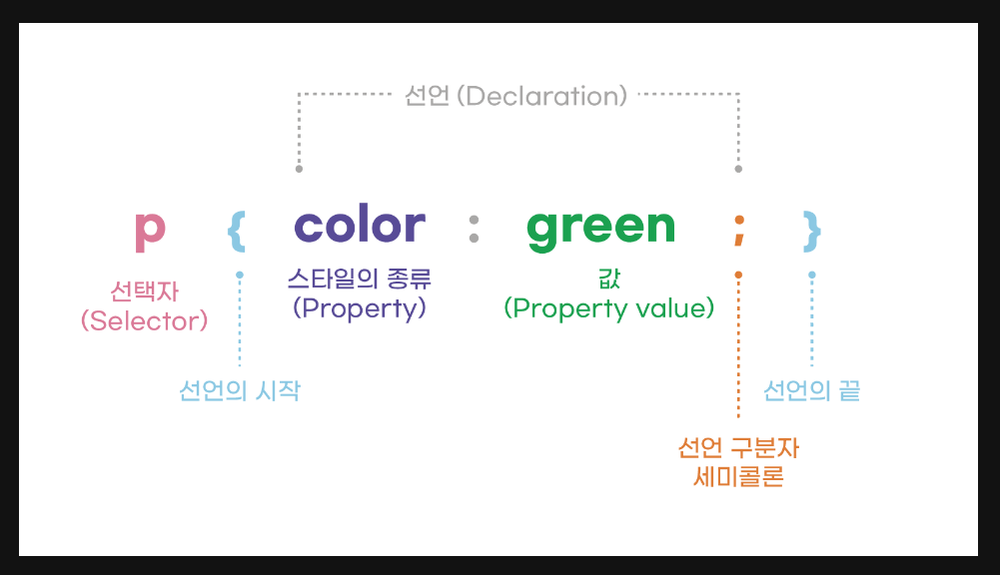

# CSS(Cascading Style Sheets)?
- Style sheet 언어
    -  HTML 문서에 있는 요소들에 선택적으로 스타일을 적용할 수 있다는 뜻
- 역할 
    - 문서의 레이아웃, 색상, 글꼴 등 시각적인 표현을 제어
    - 웹 페이지 디자인 + 스타일링
    - HTML로 작성된 내용을 꾸밈
    - 텍스트의 크기와 색상, 배경의 이미지와 색상, 여백과 패딩, 레이아웃의 배치 등 지정
- html에서 css불러오기기
    ```html
    <link href="(폴더 이름)/(파일 이름)" rel="stylesheet" type="text/css" />
    ```
---
## 구성

- 선택자(selector)
    - 스타일을 적용할 HTML 요소를 지정
- 속성(property)
    - 해당 요소의 스타일을 변경하는 데 사용
- 선언
    - ex) color: red
- 값(value)
    - 속성의 설정값을 나타냄
## 사용
- HTML 문서의 \<style> 태그 내에 포함
- 외부 CSS 파일로 링크되어 사용
## 기타
- 서로 다른 HTML 요소에 같은 스타일(rule set) 적용 가능
    - ex) 
        ```css
        p,
        li,
        h1 {
        color: red;
        }
        ```
- 프로그래밍 언어 X <!-- (+HTML) -->
- 마크업(markup) 언어 X
    - 마크업 언어 : 태그 등을 이용하여 문서나 데이터의 구조를 명기하는 언어 중 하나
---
## 주요속성
- **색상**: **`color`**
- **폰트**: **`font-family`**, **`font-size`**, **`font-weight`**, **`font-style`**
- **레이아웃**: **`width`**, **`height`**, **`margin`**, **`padding`**, **`display`**
- **배경**: **`background-color`**, **`background-image`**, **`background-position`**
- **테두리**: **`border`**, **`border-color`**, **`border-width`**, **`border-radius`**
- **텍스트**: **`text-align`**, **`text-decoration`**, **`line-height`**
#### Details
- **color**
    - 텍스트 색상 지정
    - 키워드(예: red, blue) or 색상값(RGB, HEX, HSL)으로 지정 가능
- **font-size**
    - 텍스트의 글꼴 크기를 지정
    - 단위 : px(픽셀), em(상속된 글꼴 크기에 상대적), rem(루트 글꼴 크기에 상대적) 등
- **width**
    - 요소의 너비(가로 길이) 지정
    - 단위 : px(픽셀), %, em(상대적인 길이) 등
- **height**
    - 요소의 높이(세로 길이) 지정
    - 단위 : px(픽셀), %, em(상대적인 길이 단위) 등
- ex)
    ```css```
    ```css
    /* 텍스트의 색상을 빨간색으로 지정 */
    color: red;

    /* 텍스트의 글꼴 크기를 20px로 지정 */
    font-size: 20px;

    /* 요소의 너비를 200px로 지정 */
    width: 200px;

    /* 요소의 높이를 100%로 지정 */
    height: 100%;

    ```

---

# Selector
1. **Element Selector (요소 선택자)**
    - 지정된 타입의 모든 HTML 요소 선택
    - ex) `p` : 모든 `<p>` 요소 선택
        `css`
        ```css
        p {
        color: blue;
        }
        ```
        `html`
        ```html
        <p>hj</p>
        ```
2. **ID Selector (ID 선택자)**
    - 지정된 ID를 가진 페이지의 요소 선택 (HTML 페이지에서 각 ID 값은 고유해야 함)
    - ex) `#my-id` : `<p id="my-id">` or `<p id="my-id">` 선택
        `css`
        ```css
        #my-id {
        font-size: 20px;
        }
        ```
        `html`
        ```html
        <p id="my-id">This is a hj with ID "my-id".</p>
        ```
3. **Class Selector (클래스 선택자)**
    - 지정된 클래스를 가진 페이지의 요소 선택
    - 하나의 페이지에 여러 인스턴스의 동일한 클래스가 나타날 수 있음
    - ex) `.my-class` : `<p class="my-class">`, `<a class="my-class">` 선택
        `css`
        ```css
        .my-class {
        background-color: yellow;
        }
        ```
        `html`
        ```html
        <p class="my-class">This is a hj with class "my-class".</p>
        <a class="my-class">This is a HJ with class "my-class".</a>
        ```
4. **Attribute Selector (속성 선택자)**
    - 지정된 속성을 가진 페이지 요소 선택
    - ex) `img[src]` : `` 선택 O, `` 선택 X
        `css`
        ```css
        img[src] {
        border: 1px solid black;
        }
        ```
        `html`
        ```html
        
        ```
5. **Pseudo-class Selector (가상 클래스 선택자)**
    - 지정된 상태일 때만 특정 요소 선택
    - ex) `a:hover`는 링크에 마우스 커서가 올려져 있을 때의 `<a>`를 선택
        `css`
        ```css
        a:hover {
        text-decoration: underline; //텍스트에 밑줄 추가
        }
        ```
        `html`
        ```html
        <a href="#">Hover over this link</a>
        ```
---
# css 기본 스타일링
- **박스 모델(Box Model)**
    - CSS의 주요 개념 중 하나
    - HTML 요소들을 상자 모델로 생각
    - 각 요소는 content(내용), padding(여백), border(테두리), margin(외부 여백)으로 이루어진 상자로 간주됨

