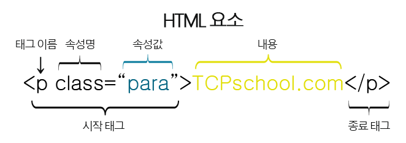
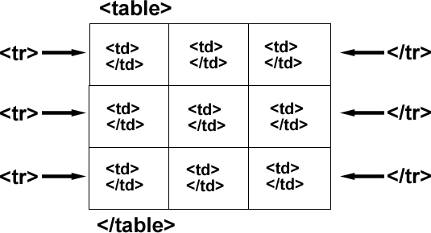

# **HTML(HyperText Markup Language)?**

- 웹 페이지의 구조를 정의하는 마크업 언어

## 구조

- **여는 태그(Opening Tag)**: 요소의 시작 **`<tag>`**
- **내용(Content)**: 요소의 실제 내용
- **닫는 태그(Closing Tag)**: 요소의 끝 **`</tag>`**
- ex)
```html```
    ```html
    <p>hello</p>
    ```
## 속성

- **속성(Attribute)**: 요소에 대한 추가 정보를 제공
- **속성 값(Attribute Value)**: 따옴표로 둘러싸여 있음
- ex)
```html```
    ```html
    <a href="https://www.example.com">Example</a>
    ```



---
## 태그
### **구조 정의**

- **`<!DOCTYPE html>`**: 문서의 타입 정의
- **`<html>`**: 전체 HTML 문서를 감싸는 루트 요소
- **`<head>`**: 문서의 메타데이터를 포함
- **`<title>`**: 문서의 제목을 정의
- **`<body>`**: 문서의 본문을 포함

- ex)
```html```
    ```html
    <!DOCTYPE html>
    <html>
    <head>
        <title>My HTML</title>
    </head>
    <body>
        <h1>Hello, World!</h1>
        <p>This is a paragraph</p>
    </body>
    </html>
    ```

### **텍스트 정의**

- **`<h1>`** ~ **`<h6>`**
    - 제목(heading) 정의
    - ex) 
    ```html```
        ```html
        <h1>제목 1</h1>
        <h2>제목 2</h2>
        <h3>제목 3</h3>
        ```
- **`<p>`**
    - 문단(paragraph) 정의
    - ex)
    ```html```
        ```html
        <p>이것은 문단입니다.</p>
        ```
- **`<a>`**:
    - 하이퍼링크(anchor) 정의
    - 다른 문서나 위치로 이동할 수 있는 링크 생성
    - ex)
    ```html```
        ```html
        <a href="http://www.example.com">링크 텍스트</a>
        ```
- **`<span>`**: *인라인 요소*에 대한 컨테이너 정의
    - *인라인 요소(Inline Element)* : 텍스트나 다른 인라인 요소와 함께 한 줄에 표시되는 요소
- **`<strong>`**: 텍스트 굵게(bold) 표시
- **`<em>`**: 텍스트를 이탤릭체(italic)로 표시

### **목록 정의**

- **`<ul>`**: 순서 없는 목록 정의
- **`<ol>`**: 순서 있는 목록 정의
- **`<li>`**: 목록의 항목 정의

### **이미지 정의**

- **``**: 이미지를 문서에 삽입

### **표 정의**

- **`<table>`**: 표를 정의
- **`<tr>`**: 표의 행을 정의
- **`<th>`**: 표의 제목 셀을 정의
- **`<td>`**: 표의 데이터 셀을 정의



### **양식 정의**

- **`<form>`**: 입력 양식을 정의
- **`<input>`**: 사용자로부터 정보를 입력 받음
- **`<button>`**: 클릭 가능한 버튼을 정의
- **`<textarea>`**: 여러 줄의 텍스트 입력을 받음

### **기타**
| \<div> | \<span> |
| --- | --- |
| 블록 수준 요소|인라인 요소 |
| 웹페이지의 특정 섹션에 첨부에 용이 | 웹페이지 줄의 작은 부분에 CSS를 첨부에 용이 |
| 정렬 속성 허용 | 정렬 속성 허용 X |
| 해당 섹션을 강조 표시하기 위해 섹션을 래핑하는 데 사용 | 웹페이지에서 강조표시하려는 특정 단어를 래핑하는 데 사용 |
- **`<hr>`**: 수평선을 삽입
