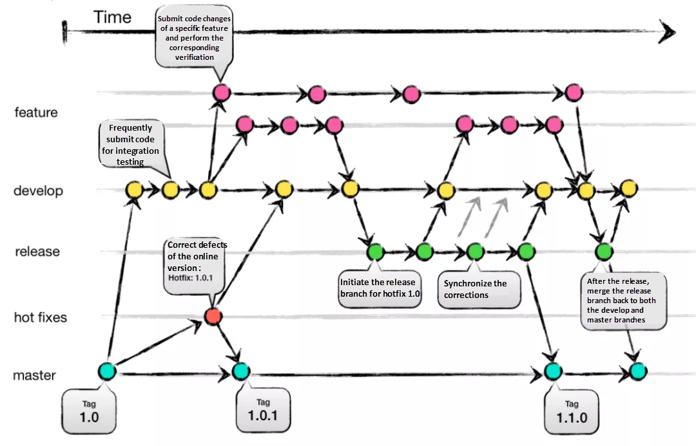
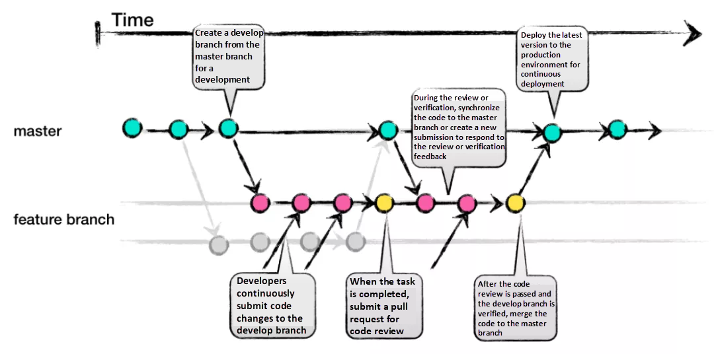

## Git
- **분산 버전 관리 시스템**
    - 개발자들이 프로젝트의 변경 사항을 추적하고 관리하는 도구
- **로컬 저장소 및 원격 저장소**
    - 개발자는 로컬 컴퓨터에서 작업하고, 변경 사항을 중앙 서버인 원격 저장소에 업로드 가능
- branch
    - 프로젝트를 안전하게 분리하고 여러 기능을 동시에 개발하기 위해 사용됨
- Merge
    - 다른 브랜치의 변경 사항을 현재 작업 중인 브랜치에 **통합**
- Commit
    - 변경 사항 저장 
    - 해당 시점의 스냅샷을 만듦
- Git 명령어
    - add, commit, push, pull, branch, checkout 등

--- 

## GitHub
- **Git 호스팅 서비스**
    - Git 저장소를 호스팅, 협업을 용이하게 함
- **프로젝트 관리**
    - 이슈 트래킹, 프로젝트 보드, 워크플로우, 코드 리뷰 등의 기능을 제공하여 프로젝트 관리에 용이
- **협업**
    - 함께 작업, 코드 리뷰, 피드백 제공
- Pull Request
    - 변경 사항을 다른 개발자들과 검토하고 병합하는 데 사용됨
- Fork
    - 다른 프로젝트를 자신의 계정으로 복제하여 개별적으로 수정, 기여 가능

---

# Git 기본 명령어
- git **init** 
    - 새로운 Git 저장소 **초기화**
- git **clone [url]** 
    - 원격 저장소의 복사본을 로컬에 **가져옴**
- git **add [파일명]** 
    - 파일을 **스테이징 영역**에 **추가**
- git **commit -m "[커밋 메시지]"** 
    - 스테이징 영역에 있는 **파일 상태 저장**
- git **push** 
    - 로컬 저장소의 변경 사항을 **원격 저장소에 업로드**
- git **pull** 
    - 원격 저장소의 변경 사항을 **로컬 저장소로 가져옴**
- git **branch [브랜치명]** 
    - 새로운 **브랜치**를 **생성**
- git **checkout [브랜치명]** 
    - 해당 브랜치로 **이동**
- git **merge [브랜치명]** 
    - **다른** 브랜치의 변경 사항을 **현재** 브랜치에 **병합**

---

# GitHub 협업의 기초 
- 버전 관리 
    - Git : 파일의 버전 관리, 변경 내역 추적
- Repository  
    - 프로젝트의 모든 파일과 변경 내역을 포함하는 디렉토리
    - 구분 : 로컬 저장소, 원격 저장소로 
- Branch
    - 작업 분리와 독립적인 관리를 위한 작업 영역
- Commit
    - 변경 내역 저장 
    - 변경 사항의 스냅샷 저장
- Pull Request
    - 변경 사항 검토, merge하기 위한 요청
- merge
    - 하나의 브랜치에서 다른 브랜치로 변경 사항을 통합하는 작업
- 충돌 해결
    - 동시에 수정된 파일을 병합할 때 발생하는 충돌을 해결하는 과정
## Ex) Git Flow

#### branch 종류 및 내용 설명
- **main** branch
    - 제품의 배포 가능한 상태를 유지하는 메인 브랜치
    - 언제든지 제품의 현재 버전이나 최신 버전을 확인할 수 있어야 함
- **develop** branch
    - main 브랜치에서 분기된 브랜치
    - 다음 릴리스를 위한 개발이 진행되는 곳
    - 새로운 기능 추가나 버그 수정 등이 이루어짐
    - 개발 환경의 코드를 유지
- **feature** branch
    - 새로운 기능을 개발하기 위한 브랜치
    - develop 브랜치에서 분기 
    - 개별 기능의 개발을 위해 사용 
    - 기능이 완료되면 develop 브랜치로 merge
- **fix** branch
    - develop 브랜치에서 나온 버그 수정 브랜치
    - 주로 기능 개발 후 발견된 버그를 고치기 위해 사용
    - 수정이 완료되면 develop 브랜치로 merge
- **hotfix** branch
    - main 브랜치에서 나온 긴급한 버그 수정 브랜치
    - 배포된 제품에서 발견된 심각한 버그를 고치기 위해 사용
    - 수정이 완료되면 main과 develop 브랜치로 merge
- **master** branch
    - 운영 환경의 코드 유지
#### 장점
- **브랜치 관리의 명확성**
    - feature, develop, release, hotfix, master 등의 명확하게 구분되는 브랜치 구조 제공
- **배포 안정성**
    - release 브랜치에서의 테스트와 QA 과정을 통해 안정성이 검증된 기능들이 master 브랜치로 병합되어 배포
- **협업 효율성**
    - 여러 개발자가 동시에 작업할 수 있는 환경 제공
    - 개발자들은 서로의 작업에 영향 X, 병렬적인 개발 진행 가능
- **버전 관리와 롤백**
    - 각 버전에 대한 태그를 사용 → 제품 버전 관리
    ⇒ 특정 버전의 코드 쉽게 확인, 필요한 경우 이전 버전으로 롤백 가능
- **유지 보수에 용이**
    - hotfix 브랜치 ⇒ 긴급한 버그 수정 or 보안 취약점에 대한 즉각적인 조치 적용 가능
    ⇒ 문제를 빠르게 해결 및 유지 보수 가능
#### 단점
- **복잡성**
    - 다양한 브랜치를 사용 ⇒ 초기 설정 복잡, 팀원들이 이해하고 따르기 어려울 수 있음
    - 특히 작은 규모의 프로젝트나 단기적인 작업에는 지나치게 복잡한 구조일 수 있음
- **다소 높은 진입장벽**
    - 처음 접할 경우, 적응에 어려움이 있을 수 있음
    - 각각의 브랜치의 역할과 용도를 이해하고 적절하게 사용하기 위해서는 시간과 노력이 필요
- **느린 릴리스**
    - 주요 기능 → develop 브랜치에 통합
     새로운 릴리스 → release 브랜치에서 이루어짐
    ⇒ 검증 or 테스트 과정이 추가되어 개발의 속도가 느림
    ⇒ 따라서 빠른 배포가 필요한 프로젝트에는 적합하지 않을 수 있다.
- **팀 규모에 대한 제한**
    - 작은 팀 or 개인 프로젝트에 적용하기에는 많은 브랜치와 과정이 불필요하고 부담스러울 수 있음
- **유연성의 한계**
    - 비교적 엄격한 브랜치 전략 사용
    ⇒ 예외 상황 or 특별한 요구사항에 대한 대응이 제한적일 수 있음
    - 특정 기능 or 수정을 빠르게 배포해야 할 경우에는 깃 플로우의 구조적인 제약으로 인해 어려움을 겪을 수 있음
## Ex) GitHub Flow

#### 의미
- GitHub를 이용한 일반적인 협업 프로세스
    + 소프트웨어 개발에서의 협업 및 버전 관리를 위한 작업 흐름(Workflow) 중 하나
    + 다른 협업 툴에서도 비슷한 작업 흐름을 따를 수 있음
- **단일 브랜치 사용하여 개발**

#### 주요 단계
- **Branch**
    - 우선 기존 코드를 변경 X, 새로운 브랜치 만듦
    - when
        - 새로운 기능을 추가 or 버그 수정을 위해 작업을 시작
- **Commit**
    - 해당 브랜치에서 작업 진행
    - 필요한 변경 사항을 커밋하여 로컬 저장소에 저장
- **Pull Request (PR)**
    - when
        - 작업 후 코드 변경 사항을 리뷰, merge하기 전
    - why
        - 해당 변경 사항을 다른 개발자들에게 검토 및 피드백 받기 위함
    - what to do 
        - 원본 브랜치에 대한 PR을 생성
- **Code Review** 
    - 다른 개발자들이 작성 코드 검토 및 평가 (+피드백 제공)
    - Reviewer 고려사항
        - 코드의 가독성: 코드의 명확성, 이해하기 쉬운지 여부 확인
        - 코딩 스타일: 프로젝트에서 정의된 코딩 스타일 가이드에 따라 코딩 스타일을 준수하는지 확인
        - 오류 및 버그: 잠재적인 오류나 버그가 있는지 확인, 안전성을 보장하기 위한 수정이 필요한 경우 제안
        - 최적화: 성능 향상 or 리소스 효율적으로 사용할 수 있는지 확인, 개선점 제안
        - 테스트 케이스: 변경 사항에 대한 테스트 케이스가 충분한지 확인, 누락된 부분 추가를 제안
- **Merge**
    - Reviewer의 승인을 받은 후, Pull Request를 Merge하여 변경 사항을 원본 브랜치에 적용
- **Deploy**
    - 변경 사항 Merge 후 해당 변경 사항이 실제로 동작하는지 테스트하고 배포
- **Release** (프로젝트의 버전을 공식적으로 발표하고 배포하는 과정)
    - 일정 기간 or 특정 기능이 적용된 버전 릴리스

#### 장점
- **간단하고 직관적인 구조**
    - master와 develop 두 개의 브랜치만 사용
    - 전략에 대한 이해와 사용이 쉽고, 프로젝트를 빠르게 시작 가능
- **지속적인 배포**
    - 지속적인 배포(CD)를 촉진
    - 작은 단위로 개발한 기능이나 수정사항을 빠르게 develop 브랜치에서 master로 머지하여 배포 가능
- **유연성과 빠른 피드백**
    - 작은 규모의 변경 사항을 빠르게 테스트
    - 검증할 수 있는 환경 제공
    - 신속하게 사용자에게 제품을 전달, 피드백을 받음
- **충돌 최소화**
    - 여러 개발자가 동시에 develop 브랜치에서 작업 가능
    - 각각의 작업 : 독립적인 브랜치에서 진행 ⇒ 충돌 발생할 가능성 ↓
#### 단점
- **대규모 프로젝트에 제한적**
    - 작은 규모의 프로젝트나 개인 프로젝트에 적합
        ⇒ 대규모 프로젝트 : 복잡한 작업 흐름 or 추가적인 브랜치 전략이 필요할 수 있음
- **배포 위험성**
    - develop 브랜치에서 master로 바로 머지 가능
        ⇒ 테스트와 검증 절차 X
        ⇒ 잠재적인 위험성 포함 가능성이 있음
        ⇒ 보안 방안 : 테스트와 검증 과정 강화 방법 도입
- **배포 관리의 어려움**
    - 단일 master 브랜치를 사용하여 배포를 관리
        ⇒ 동일한 코드 베이스에서 여러 버전 관리 or 세밀한 배포 관리 제어에 어려움을 줄 수 있음
        ⇒ 다른 전략을 고려해야 할 수 있음
---

## 예시
1. hj가 새로운 기능을 추가하기 위해 feature 브랜치를 생성한다.
2. hj는 코드를 작성하고 커밋한다.
3. hj는 변경 사항을 원격 저장소에 푸시한다.
4. hj는 GitHub에서 master 브랜치로 Pull Request를 생성한다.
5. kj이와 sm이는 hj의 코드를 리뷰하고 필요한 수정 사항을 요청한다.
6. hj는 요청된 수정 사항을 반영하고 Pull Request를 다시 업데이트한다.
7. 리뷰어들이 만족할 때까지 반복하고, 최종적으로 master 브랜치로의 병합이 승인된다.