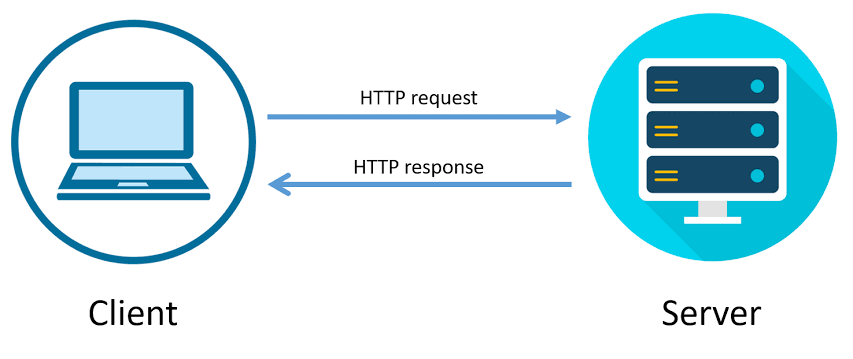
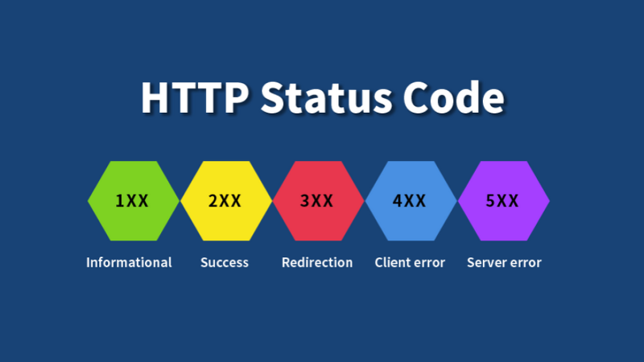
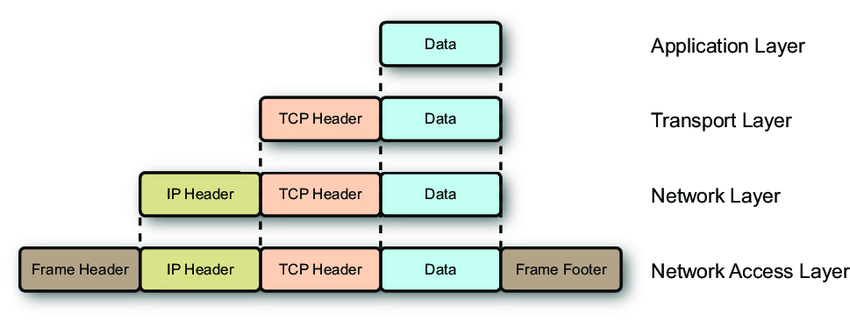
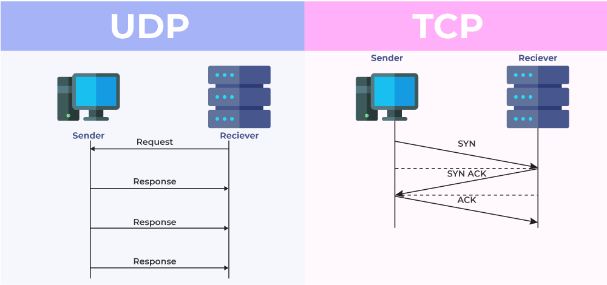

# HTTP
## (Hypertext Transfer Protocol)
---
### 의미
- 웹에서 **데이터**를 전송하는 데 사용되는 **프로토콜**
- **데이터** : 텍스트, 이미지, 비디오, 오디오 및 기타 멀티미디어 파일
- **프로토콜** : 컴퓨터 내부 or 컴퓨터 사이에서 데이터의 교환 방식을 정의하는 규칙 체계

---
## 특징 (1) - Stateless
- **상태 유지 X**
    - **장점**
        - **확장성** : 각 요청의 대한 독립적인 처리 
        - **유연성** : **클라이언트**가 어떤 요청을 보내든지 서버가 상태를 기억할 필요 X
        - **간단한 관리**: 상태 유지에 따른 복잡성 + 잠재적인 문제점 X ⇒ 운영 및 유지 관리가 용이
        - **안정성**: 오류 발생 시 **클라이언트**가 다른 서버로 재요청 가능
            - **클라이언트** : 사용자의 요청을 받아 서버에 전달, 서버로부터 받은 응답을 처리하여 사용자에게 제공
    - **단점**
        - **상태 유지의 어려움** 
            - 일부 경우만 해당
            - ex) 세션 데이터를 관리 : 별도의 메커니즘이 필요할 수도 있음
        - **클라이언트 부담** 
            - 클라이언트 : 모든 요청에 필요한 상태 정보 제공 ⇒ 클라이언트와 서버 간의 통신 부하를 증가시킬 수 있음
        - **보안 문제** 
            - 클라이언트와 서버 간의 상태를 공유할 수 있는 보안 문제
            - ex) 인증 토큰 저장 X, 클라이언트에서 전달 : 안전하게 보호해야함
        - **성능 저하** 
            - 특히 대규모 시스템에서 더 큰 부담을 줄 수 있음
- **각각의 요청 → 서로 독립적**
- **이전 요청과 관련 X**

## 특징 (2) - Connectionless 
- **의미**
    - 네트워크 통신에서 데이터 패킷을 보낼 때 각 패킷이 **독립적**으로 처리
    ⇒ 패킷 간의 **연결 X**
    ⇒ 패킷들 간에 **상태 유지 X**
    - 각 요청 : 서버와의 **단일 연결**
    - 요청 후 연결이 **닫힘**

- **한계**
    - 원인 : 패킷의 **독립적**인 처리
    ⇒ **오버헤드** 
        - 패킷의 헤더에 대한 오버헤드 발생할 수 있음
        - 많은 작은 패킷이 발생할 경우 특히 두드러짐

        ⇒ **순서 보장 X** 
        - 일부 응용 프로그램에서 문제가 될 수 있음
    - 원인 : 통신에서 서버가 클라이언트의 상태 유지 X
        ⇒ **상태 유지 X**
        - 클라이언트의 이전 상태에 따라 다른 응답 제공이 어려움

- **Persistent Connections** (지속 연결)
    - **의미**
        - Connectionless의 **한계 극복**을 위한 메커니즘 중 하나
        - 클라이언트와 서버 간에 **연결 유지**
        - 요청 및 응답을 **동일한 연결**을 통해 처리하는 것
    - **효과**
        - **더 효율적인 통신** : 연결을 맺고 끊는 오버헤드 감소 ⇒ 더 효율적인 통신
        - **상태 유지**(연결유지) : 세션 데이터 저장 or 인증 상태 유지에 유용
        - **순서 보장** : 연결이 유지되는 한 **순서대로 처리**되는 요청과 응답
    - **기타 정보**
        - HTTP/1.1에서 기본적으로 사용 됨
        - Keep-Alive라는 헤더를 통해 연결 유지방식으로 구현
        - 웹 서버와 클라이언트 간의 통신 효율성 구성
        - HTTP/2 및 최신 프로토콜에서도 계속 사용됨

### 특징 (3) - Text-based
- **요청, 응답 : 텍스트 형식**
---
### HTTP 메서드 
##### (매서드 : 일정한 계획에 따른 방법, 격식과 정연에 따른 순서)
- *GET* : 서버에서 리소스를 가져오기 위함
- *POST* : 서버로 데이터 제출을 위함
- *DELETE* : 서버에서 리소스 삭제를 위함
- **PUT, PATCH**, *HEAD, OPTIONS, TRACE* 등
#### PUT && PATCH 차이점
- **PUT** : 
    - 클라이언트가 요청하는 리소스의 **전체**를 업데이트
    - 클라이언트
        - PUT 요청 본문에 업데이트된 **전체** 리소스 제공
        - 리소스의 일부를 변경 X
        - 리소스 **전체**를 완전히 대체 O
    - **대체 업데이트**에 사용됨
- **PATCH**
    - 클라이언트가 요청하는 리소스의 **일부만**을 업데이트
    - 클라이언트 
        - PATCH 요청 본문에 업데이트할 리소스의 **일부만**을 제공
        - 변경할 리소스의 **일부**에 대한 업데이트를 수행
    - **부분적 업데이트**에 사용됨
---
### HTTP 상태 코드
- *1xx* : 정보 전달
- *2xx* : 성공적인 요청처리 표시
- *3xx* : 추가 동작이 필요함을 표시
- *4xx* : 클라이언트 오류 표시
- *5xx* : 서버 오류 표시

### 자주 사용되는 상태 코드
- *200 OK* : 일반적인 성공 응답 코드
- *201 Created* : 
    - 성공적인 요청처리로 새로운 리소스가 생성됨을 표시 
    - 용도 : POST 요청의 응답
- *204 No Content* :
    - 요청은 성공했지만 서버에서 응답 본문에 내용이 없음을 표시
    - 용도 : PUT or DELETE 요청
- *400 Bad Request* : 클라이언트의 요청이 서버에서 이해 X or 잘못된 구문으로 구성됨을 표시
- *401 Unauthorized* : 클라이언트가 인증 X, 요청한 리소스에 접근 불가능 표시
- *403 Forbidden* : 클라이언트가 요청한 리소스에 대한 액세스 권한이 없음을 표시
- *404 Not Found* : 요청한 리소스를 서버에서 찾을 수 없음을 표시
- *405 Method Not Allowed* : 클라이언트가 요청한 HTTP 메서드가 해당 리소스에서 허용되지 않음을 표시
- *500 Internal Server Error* : 서버에서 처리 중에 오류가 발생했음을 표시
- *503 Service Unavailable* : 
    - 서버가 현재 요청을 처리할 수 없음을 표시
    - 일시적으로 사용 불가능한 상태일 수 있음
---
### HTTP의 활용
- 웹 브라우징
    - 사용자가 웹 브라우저를 통해 웹 페이지 요청, 표시하는 과정
    - 웹 페이지의 HTML, CSS, JS **멀티미디어 리소스**를 요청하고 받아옴
        - **멀티미디어 리소스** :파일 및 이미지, 오디오, 비디오 등
- 웹 서비스 
    - 웹 서비스를 통해 다른 시스템 간에 통신
    - 데이터를 요청, 응답 방법 : **RESTful API (웹 서비스)**
### RESTful API
- **의미**
    - Representational State Transfer(REST) 아키텍처 스타일을 따르는 웹 API
    - REST 
        - 네트워크 기반 소프트웨어 아키텍처를 설계하기 위한 가이드라인
        - 클라이언트와 서버 간의 통신을 위한 규칙 제공

- **특징 및 원칙**
    - **자원**(Resource): 모든 것을 자원으로 표현
        - 각 자원 : 고유한 식별자(URI) 가짐
        - URI를 통해 자원에 접근
    - **행위**(Verb): HTTP 메서드 사용 ⇒ 자원에 대한 행위 표시
    - **표현**(Representation): 자원의 표현 방법은 서버와 클라이언트 간에 전송되는 데이터 형식
        - 일반적으로 JSON or XML 형식의 데이터가 사용됨
    - **무상태**(Stateless): 클라이언트와 서버 간의 통신은 무상태적이어야 함
        - 각 요청 : 서버에 대한 충분한 정보를 포함 ⇒ 완전한 요청이 돼야함
- **효과**   
    - 간결하고 직관적인 API 만들기 가능
    - 클라이언트와 서버 간의 통신의 단순화,  높은 유연성 
    - 다양한 애플리케이션 간의 상호 작용을 위한 표준화된 방법 제공 ⇒ 개발자들이 서로 통합하기 쉽게 해줌
---
### HTTP 헤더
- 헤더 : 데이터 앞 부분에 파일에 대한 정보를 실어놓은 부분
- 의미
    - **클라이언트와 서버가 요청 or 응답**
    - **부가적인 정보를 전송**할 수 있도록 해줌
- 종류
    - General header : 요청, 응답 모두 적용 but, **바디**에서 최종적으로 전송되는 데이터와 관련X
        - **바디** : HTTP 요청 or 응답에서 실제로 전송되는 데이터
    - Request header : 페치될 리소스 or 클라이언트 자체에 대한 자세한 정보 포함 = 내가 보내는 메세지의 헤더
    - Response header : **응답**에 대한 부가적인 정보를 갖는 헤더 = 내가 받은 메세지의 헤더
        - **응답** : 위치 또는 서버 자체에 대한 정보(이름, 버전 등)
    - Entity header: 컨텐츠 길이나 **MIME 타입**과 같이 **엔티티 바디에 대한 자세한 정보를 포함하는 헤더**
        - **MIME 타입** : 파일의 종류를 **식별**하기 위한 표준 인터넷 미디어 타입
        - **엔티티 바디** : HTTP 메시지의 **실제** 데이터 부분

---
### IP (Internet Protocol)
- 컴퓨터 네트워크 상에서 **패킷 교환**을 위한 프로토콜
- HTTP : IP를 통해 데이터 전송
    ⇒ 정확한 위치로 데이터 전달
---
### 패킷
- **의미**
    - 컴퓨터 네트워크에서 데이터를 전송하는 데 사용되는 **작은 조각**
- **목적**
    - 데이터 전송 : 큰 데이터 → 작은 단위 ⇒ 효율적인 데이터 전송
- **구성**
    - *헤더(Header)*:
        - 송신자 및 수신자의 주소, 전송 제어 정보 등의 메타데이터를 포함
    - *페이로드(Payload)*:
        - 실제로 전송되는 데이터를 포함
            - 예 (이메일) : 이메일의 본문이 페이로드가 될 수 있음
    - *트레일러(Trailer)*:
        - 선택적으로 포함될 수 있는 추가 정보
        - 패킷의 끝 표시

<!--  -->

---
### 패킷 교환을 위한 프로토콜
#### TCP (Transmission Control Protocol)
- HTTP의 기본 전송 프로토콜 중 하나
- 연결 지향적, 신뢰성↑ 통신 제공
#### UDP (User Datagram Protocol)
- 신뢰성↓, 연결이 없는 프로토콜
- HTTP와 함께 사용되는 일반적인 프로토콜 X
- DNS(Domain Name System)에서 사용 가능

