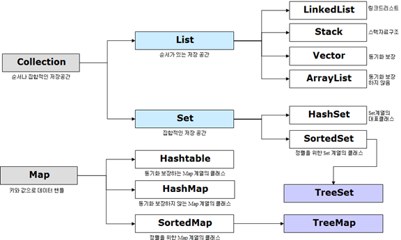
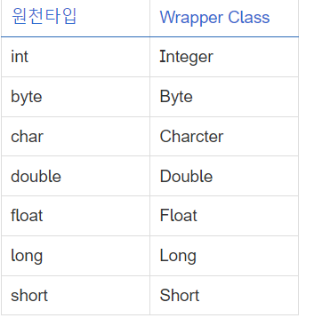
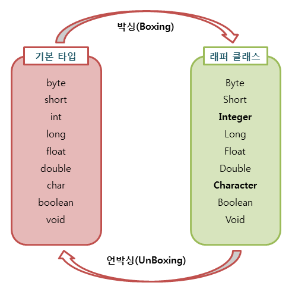

# 컬렉션 프레임워크
- 일단 단어를 풀어보자면 컬렉션은 다수의 데이터의 그룹 또는 집합  이고 프레임워크 는 표준화된 프로그래밍 방식을 의미한다. 
- 컬렉션 프레임워크란 데이터 그룹을 저장하는 클래스들을 표준화한 설계이다
- 일관된 API(자바에서 제공하는 명령어): List, Queue, Set, Map 등의 인터페이스를 제공하고 이를 구현하는 클래스를 제공한다.
- 프로그래밍 노력 감소 / 프로그램 속도 및 품질 향상: 추상화 개념이 성공적으로 구현되어 있으며 자료구조, 알고리즘을 구현하기 위한 코드를 직접 작성할 필요 없이 이미 구현된 컬렉션 클래스를 목적에 맞게 선택하여 사용하면 된다. 또한 제공되는 API 코드는 검증과 최적화가 되어있다.
# 컬렉션 프레임 워크 구조도

# 컬랙션 프레임 워크 주요 클래스

- 컬렉션 인터페이스는 크게  List, Queue, Set으로 3가지 상위 인터페이스로 분류할 수 있으며 여기에 추가로 Map의 경우 컬렉션 인터페이스를 상속받고 있지 않지만 컬렉션으로 분류된다.
# list
- 순서가 있는 데이터 집합으로 데이터 중복을 허용한다. (순서가 있는 저장 공간)
## arrayList
- 배열을 이용하여 만든 리스트로 대표적인 컬렉션 클래스이다.
- 배열과 유사하게 데이터를 순차적으로 저장합니다.
- 배열의 크기를 자동으로 조정하여 요소를 추가하거나 제거할 수 있습니다.
- ArrayList는 인덱스를 사용하여 요소에 접근할 수 있으며, 요소의 순서가 유지됩니다.(단방향 포인터 구조로 인덱스로 조회가 가능하기 때문에 인덱스만 안다면 빠르게 조회가 가능하다. )
- ArrayList는 데이터를 추가, 삭제, 검색 및 순회하는 다양한 메서드를 제공하여 편리하게 사용할 수 있습니다.
- 동적으로 크기가 조정되는 배열을 활용하여 데이터를 효율적으로 관리할 수 있습니다.
-  삽입/삭제 시 뒤에 데이터를 뒤로 밀거나 앞으로 당겨야하므로 느리다. 
## Linkdeilst 
- 노드와 포인트를 이용하여 만든 리스트이다. 
- 노드는 데이터를 저장하는 부분과 다음 노드를 가리키는 링크(참조)를 포함합니다.
-  각각의 노드가 이전 노드나 다음 노드에 직접적으로 접근할 수 있다.
- 불연속적으로 저장된 데이터를 서로 연결한 형태로 구성된 자료구조이자 컬렉션이다.
- 조회보다 삽입/삭제가 많은 경우 사용하는 것이 좋다.
- 데이터를 빈번하게 삽입 또는 삭제해야 하는 상황에서 LinkedList가 유용합니다.
- 데이터를 효율적으로 추가, 삭제, 변경하기 위해 사용한다.
- 이는 프로그램 실행 중에 데이터의 양이 동적으로 변할 때 유용합니다.
- 이는 순차적인 처리가 필요한 상황에서 유용합니다.
- 스택, 큐, 양방향 큐등을 만들기 위한 용도로 쓰인다. 
```
import java.util.LinkedList;

public class Main {
    public static void main(String[] args) {
        // LinkedList 생성
        LinkedList<String> linkedList = new LinkedList<>();

        // 요소 추가
        linkedList.add("Apple");
        linkedList.add("Banana");
        linkedList.add("Orange");

        // 요소 순회
        System.out.println("LinkedList 요소:");
        for (String fruit : linkedList) {
            System.out.println(fruit);
        }

        // 요소 삭제
        linkedList.remove("Banana");

        // 삭제 후 요소 순회
        System.out.println("\nLinkedList 요소 (Banana 삭제 후):");
        for (String fruit : linkedList) {
            System.out.println(fruit);
        }
    }
}
```
## Iterator
-  자바 컬렉션 프레임워크에서 표준화된 컬렉션에 저장된 요소를 읽어오는 방법이다
- lterator 인터페이스는 각 요소에 접근하는 기능을 가졌고, Collection 인터페이스에는 Iterator를 반환하는 iterator() 메서드가 정의되어 있다.
-  boolean hasNext()	읽어 올 요소가 있는지 확인한다. 있다면 true, 없다면 false 반환한다..
- Object next()	다음 요소 읽어오기. ( hasNext()로 확인 후 사용하는 것이 안전 하다)
-  void remove()	읽어온 요소 삭제하기. ( next()로 읽어온 후 사용해야 한다 )
## vector
- thread-safe하다는 특징을 가지고 있어 비교적 성능이 좋지 않고 무거워 잘 쓰이지 않는다.
- ArrayList와 비슷하게 배열로 만들어진 리스트로 과거의 대용량 처리를 위해 사용하였다.
- 크기를 동적으로 조절할 수 있는 가변 길이 배열입니다.
- 멀티스레드 환경에서 요소의 추가, 삭제 등의 작업을 한다.
- 요소의 순서에 따라 접근해야 할 떄 좋다.
## stack
- LIFO(Last-In-First-Out) 특성을 가지는 자료구조이다
- 들어올 때 Push, 나갈 때는 Pop이라는 용어를 사용한다. 
- 가장 최근에 추가된 요소가 가장 먼저 제거되는 특성을 갖습니다.
```
// 요소 추가
stack.push(10);
stack.push(20);
stack.push(30);
//요소 출력
 System.out.println(stack.pop());
```
# QUeue
- 처을 들어온 원소가 처음으로 나간다는 FIFO(First-In-First-Out)이라는 특징을 가진다.
- PriorityQueue 는   우선순위를 가지는 큐로 들어온 순서가 아닌 부여된 우선순위에 따라 높은 순으로 먼저 반환한다.
- Deque는 양쪽으로 넣고 뺴는 것이 가능한 큐 자료구조이다.  
# 집합(Set)
- 순서가 없는 데이터 집합으로 데이터 중복을 허용하지 않는다. 
## Hashset
- 가장 빠른 임의 접근 속도를 가진다.
- HashSet은 요소들의 순서를 보장하지 않습니다. 삽입 순서나 정렬 순서와 관계없이 요소들이 저장됩니다.
- 여러 스레드에서 동시에 HashSet을 수정하는 경우 외부적인 동기화가 필요합니다.
- 빠른 검색 및 삽입이 필요한 경우에 사용한다.순서를 저장하지 않는다.
- 객체를 저장하기 전에 먼저 객체의 hashCode() 메소드를 호출하고 같다면 equals()로 두 객체를 비교하여 동등성을 판단한다.
- 이미 저장된 요소를 또 추가하려고 하면, 이 메서드들이 false를 반환해 추가에 실패했다는 것을 알린다. 이 특성을 잘 이용하면 컬렉션 내 중복 저장을 쉽게 방지할 수 있다.
## linkedhashset
- 중복을 허용하진 않지만 순서를 가진다.
- hashset과 다르게 순서를 저장한다.
## Treeset
- 중복을 허용하지 않고 순서도 없다. 그러나 정렬이 되어있다.
- 이진트리(최대 두 개의 자식 노드를 가질 수 있는 트리 구조)를 기반으로 데이터를 저장하는  Set 컬렉션이다.
- 중복된 요소를 허용하지 않습니다.
- 이진 검색 트리는 정렬과 검색(범위검색)에 특화되어 있으며, 비순차적으로 저장하기 때문에 노드의 추가와 삭제에 시간이 걸린다.


# map
- Key - Value 쌍으로 이루어진 데이터의 집합으로 순서는 유지되지 않으며 키(Key)의 중복을 허용하지 않으나 값(Value)의 중복은 허용한다.
- 각 키에는 하나의 값이 대응됩니다. 따라서 맵은 키를 기반으로 값을 검색하고, 값을 업데이트하거나 제거할 수 있습니다.
- Map은 키를 사용하여 값을 검색할 수 있습니다. 이를 통해 매우 빠르게 값을 찾을 수 있습니다.
- 특정 키를 사용하여 해당하는 값을 찾는 데 사용됩니다. 자주 사용되는 용도로는 데이터 캐싱, 캐시 관리, 통계 수집 등이 있습니다.
- 방대한 양의 데이터를 검색하는데 있어서 뛰어난 성능을 보인다
- Entry 객체를 저장하는 구조를 가지고 있다. 
```
  // 키-값 쌍 추가
        map.put("사과", 10);
        map.put("바나나", 5);
        map.put("딸기", 8);

        // 특정 키를 사용하여 값 검색
        System.out.println("사과의 재고: " + map.get("사과")); // 출력: 10
        System.out.println("바나나의 재고: " + map.get("바나나")); // 출력: 5

```
## hashmap
-  키-값(key-value) 쌍을 저장하는 자료구조입니다
- 키와 값을 가지고 순서는 없다. 
- 키는 중복을 허용하지 않지만 값은 중복이 가능하다. 
- 키와 값에 Null을 허용한다.
- 동기화를 보장하지 않는다. 
- HashMap은 Entry라는 내부 클래스를 정의하고, 다시 Entry 타입의 배열을 선언한다.
- 클래스 타입과 인터페이스 타입만 가능하다.
- 키(key)를 주면 해싱 함수에 의해 해시코드로 변환되고, 해당 해시코드는 배열의 각 요소인. 버킷의 인덱스 역할을 한다. 해당 버킷을 찾아가면 값을 삽입 및 조회할 수 있다.
- 해싱 충돌 : 두 개 이상의 키가 동일한 해시 코드를 가질 때 충돌이 발생한다. 이는 성능 저하를 초래할 수 있다.
- 키 기반의 유연성 : 어떤 객체든 키로 사용할 수 있다.
- 데이터의 순서가 중요하지 않고, 키를 기반으로 빠른 데이터 액세스가 필요할 때 사용하면 좋다. 또한 어떤 객체든 키로 사용할 수 있기때문에 그런 점도 고려하면 좋다.
## HashTable
- HashMap과 동일한 특징을 가지지만 thread-safe하여 동기화를 지원한다.
-  내부적으로 배열(버킷)을 사용하여 데이터를 저장하기 때문이다. 해시 테이블은 각각의 Key값에 해시함수를 적용해 배열의 고유한 index를 생성하고, 이 index를 활용해 값을 저장하거나 검색하게 된다. 여기서 실제 값이 저장되는 장소를 버킷 또는 슬롯이라고 한다.
-  get(), put(), remove() 등에 sycronized라는 키워드가 붙어있다. 
## Linkedhashmap
- 들어온 순서대로 순서를 가지는 Map이다.
- LinkedHashMap 구현을 보면, 실제로도 HashMap을 상속받는 것을 알 수 있다.
- hashMap과 다르게 Entry내 before, after 엔트리를 저장한다
- 즉 LinkedHashMap은  LinkedList와 유사한 방식으로 순서를 보장한다.
- HashMap은 순서를 보장하지 않아도 될 때, LinkedHashMap은 순서를 보장해야 될 때 사용한다.
## Treemap
- 키(key)를 기준으로 정렬이 되어 저장하는 map 이다.
- 이진트리를 기반으로 한 Map이다. 부모 키값을 비교하여 낮은 건 왼쪽 높은 건 오른쪽에 Map.Entry를 저장한다.
- TreeMap은 TreeSet과 동일하게 이진 탐색 트리 형태로 데이터를 저장한다.
- Set 인터페이스의 특성과는 달리 Map 특성을 사용하기 때문에 키(Key)와 값(Value)으로 이루어진 Entry 객체 형태로 저장한다.
- treeMap은 키 값에 따라 오름차순으로 자동 정렬이 되기 때문에 Set() 메서드를 활용하지 않더라도 순서를 알고 있으면 직접적으로 접근하기가 더욱 쉽다
# 래퍼 클래스
- Wrapper Class 는 자바에서 사용되는 원천타입의 데이터를 서로 형 변환이 가능하도록 지원해주는 Class로써, 원찬타입의 자료형들을 Class화 한것이다.

- Wrapper Class 를 사용하는 이유는 크게 두가지로 형변환과 비교연산을 하기 위해서 이다.
- 기본 데이터 타입은 null 값을 가질 수 없습니다. 하지만 래퍼 클래스를 사용하면 null 값을 가질 수 있어서 특정 상황에서 유용하게 사용될 수 있다.
- 래퍼 클래스는 기본 데이터 타입에 대응하는 메서드를 제공하여 다양한 연산을 수행할 수 있다.
- 이렇게 래퍼 클래스를 사용하면 기본 데이터 타입을 객체로 다룰 수 있습니다.
# 오토박싱 & 언박싱(autoboxing & unboxing)

1. 박싱: 기본 타입의 데이터를 래퍼 클래스의 인스턴스로 변환하는 과정
2. 언박싱: 래퍼 클래스의 인스턴스에 저장된 값을 다시 기본 타입의 데이터로 꺼내는 과정 즉, 객체에서 값을 꺼내어 기본 데이터 타입으로 변환하는 것을 말합니다.
- 박싱
```
int primitiveValue = 10; // 기본 데이터 타입 int의 값
Integer boxedValue = Integer.valueOf(primitiveValue); // int를 Integer로 박싱하여 객체 생성
```
 - 오토박싱
 ```
 int primitiveValue = 10; // 기본 데이터 타입 int의 값
Integer boxedValue = primitiveValue; // 오토박싱: int를 Integer로 자동 변환하여 객체 생성
```
- 언박싱
```
Integer number = new Integer(42); // Integer 객체 생성
int value = number.intValue(); // Integer 객체에서 int 값 추출하여 변수에 저장
System.out.println("Value: " + value); // 출력: Value: 42
```


