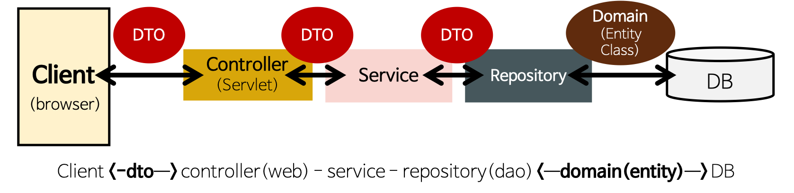

# 스프링
- 엔터프라이즈용 java 애플리케이션 개발을 편하게 할 수 있게 해주는 오픈소스 경량급 애플리케이션 프레임워크 이다.
- 동적인 웹 사이트를 개발하기 위한 여러 가지 서비스를 제공하고 있다.
- back-end 프레임워크이다.
# 스프링의 특징
1. DI(Dependency Injection)의존성 주입
- DI는 외부에서 객체 간의 관계(의존성)를 결정해 주는데 즉, 객체를 직접 생성하는 것이 아니라 외부에서 생성 후 주입시켜 주는 방식이라 할 수 있다.
- DI를 통해 객체 간의 관계를 동적으로 주입하여 유연성을 확보하고 결합도를 낮출 수 있다.
- 객체간 의존성을 개발자가 객체 내부에서 직접 호출(new연산자)하는 대신, 외부(스프링 컨테이너)에서 객체를 생성해서 넣어주는 방식이다.
2. POJO 기반의 구성
- 일반적인 Java 코드를 이용하여 객체를 구성하는 방식 그대로 사용하고 있습니다. 
- 코드를 개발할 때, 개발자가 특정한 라이브러리나 컨테이너의 기술에 종속적이지 않다 라는것을 의미합니다.
3. AOP
- 여러 클래스에 공통된 기능이 흩어져서 존재할 수 있는데, 이렇게 흩어진 공통 기능들을 관심사 라고 한다.이러한 관심사를 모듈화 하고, 쓰이는 곳에 필요할 때 연결함으로써 유지보수 혹은 재사용성을 더욱 더 높이는 것 이다.
4. IOC
- 메소드나 객체의 호출작업을 개발자가 결정하는 것이 아니라, 외부에서 결정되는 것을 의미한다.
-IoC는 제어의 역전이라고 말하며, 간단히 말해 "제어의 흐름을 바꾼다"라고 한다.
- 의존성을 역전시켜 객체 간의 결합도를 줄이고 유연한 코드를 작성할 수 있게 하여 가독성 및 코드 중복, 유지 보수를 편하게 할 수 있게 한다.
- 스프링에서는 객체 생성,의존성 객체 주입 (스스로 만드는것이 아니라 제어권을 스프링에게 위임하여 스프링이 만들어놓은 객체 주입) 의존성 객체 메소드 호출 순 이다.
# 스프링 부트
-  스프링 부트는 스프링으로 애플리케이션을 만들 때에 필요한 설정을 간편하게 처리해주는 별도의 프레임워크입니다.
-  스프링 부트를 사용하면 독립적으로 실행 가능한 Jar 파일로 프로젝트를 빌드할 수 있어, 클라우드 서비스 및 도커와 같은 가상화 환경에 빠르게 배포할 수 있습니다.
# 스프링 과 스프링 부트의 차이점
- 스프링의 경우 dependency(의존성)를 설정할때 설정파일이 매우 길고 모든 dependency에 대해 버전 관리도 하나하나 해줘야 합니다.하지만 스프링 부트는 dependency를 스프링 보다 쉡게 설정해 줄 수 있고 버전 관리도 자동이다.
- 스프링은  configuration(설정파일을 만들기 위한 애노테이션 or Bean을 등록하기 위한 애노테이션이다.)설정을 할 때도 매우 길고 모든 어노테이션 및 빈 등록 등을 설정해 줘야 합니다. 하지만 스프링 부트는 application.properties파일이나 application.yml파일에 설정하면 됩니다.
- 스프링과 달리 스프링 부트는 antoconfiguration 있는데 해당 어노테이션 덕분에 많은 외부 라이브러리, 내장 톰캣 서버 등이 실행될 수 있습니다.
# DAO
- DAO는 DB의 data에 접근하기 위한 객체로 직접 DB에 접근하여 데이터를 삽입, 삭제, 조회 등 조작할 수 있는 기능을 수행한다.
- DataBase 접근을 하기 위한 로직과 비지니스 로직을 분리하기 위해 사용한다.
- 효율적인 커넥션 관리와 보안성 떄문에 사용하기도 한다.
- DAO의 경우는 DB와 연결할 Connection 까지 설정되어 있는 경우가 많다. 현재 많이 쓰이는 Mybatis 등을 사용할 경우 커넥션풀까지 제공되고 있기 떄문에 DAO를 별도로 만드는 경우는 드물다.
```java
import javax.sql.DataSource;
import org.springframework.jdbc.core.JdbcTemplate;

public class UserDao {
    private JdbcTemplate jdbcTemplate;

    public UserDao(DataSource dataSource) {
        this.jdbcTemplate = new JdbcTemplate(dataSource);
    }

    public void insertUser(User user) {
        String sql = "INSERT INTO users (username, password) VALUES (?, ?)";
        jdbcTemplate.update(sql, user.getUsername(), user.getPassword());
    }

    public User getUserById(int id) {
        String sql = "SELECT * FROM users WHERE id = ?";
        return jdbcTemplate.queryForObject(sql, new Object[]{id}, new UserRowMapper());
    }

    // 다른 메서드들도 추가 가능
}
```
# DTO

-  계층간(Controller, View, Business Layer) 데이터 교환을 위한 자바 빈즈(JSP의 표준 액션 태그로 접근할 수 있는 자바 클래스. 즉 자바 객체)이다.
- 레이어(Layer)간 데이터를 주고 받을 때 사용할 수 있고 주로 View와 Controller 사이에서 활용한다.
- DTO는 로직을 가지지 않는 데이터 객체이고 getter/setter메소드만 가진 클래스를 의미한다.
- 계층간 데이터 교환을 위한 객체(Java Beans)이다.
- DB의 데이터를 Service나 Controller 등으로 보낼 때 사용하는 객체를 말한다.
- 즉, DB의 데이터가 Presentation Logic Tier로 넘어올때는 DTO로 변환되어 오고가는 것이다. 또 로직을 갖고 있지 않는 순수한 데이터 객체 이다. Controller Layer에서 Response DTO 형태로 Client에 전달한다.
# vo
- 자바에서 단순히 값 타입을 표현하기 위해 불변 클래스(Read-Only)를 만들어 사용한다.
- VO의 핵심 역할은 equals()와 hashcode() 를 오버라이딩 하는 것이다.
- VO 내부에 선언된 속성(필드)의 모든 값들이 VO 객체마다 값이 같아야, 똑같은 객체라고 판별한다.
- VO는 Getter와 Setter를 가질 수 있으며, VO는 테이블 내에 있는 속성 외에 추가적인 속성을 가질 수 있으며, 여러 테이블(A, B, C)에 대한 공통 속성을 모아서 만든 BaseVO 클래스를 상속받아서 사용할 수 도있습니다.
- 오로지, 읽기 기능만 가능하다
- 스프링에서는 보통 VO를 도메인 객체로 사용하고, DTO는 컨트롤러와 서비스 사이에서 데이터 전송을 위해 사용됩니다
- DTO는 Layer간의 통신 용도로 오고가는 객체, VO는 특정한 비즈니스 값을 담는 객체 이다. 또 vo는 불변 클래스 이다.
```java
public class Student {
    private String studentId;
    private String name;

    // 생성자, getter, setter 등 생략

    @Override
    public boolean equals(Object o) {
        if (this == o) return true;
        if (o == null || getClass() != o.getClass()) return false;
        Student student = (Student) o;
        return Objects.equals(studentId, student.studentId) &&
                Objects.equals(name, student.name);
    }

    @Override
    public int hashCode() {
        return Objects.hash(studentId, name);
    }
}
```
# Entity
- Entity 클래스는 실제 DataBase의 테이블과 1 : 1로 매핑 되는 클래스로, DB의 테이블내에 존재하는 컬럼만을 속성(필드)으로 가져야 한다.
- Entity 클래스는 상속을 받거나 구현체여서는 안되며, 테이블내에 존재하지 않는 컬럼을 가져서도 안된다.
- 구현 method는 주로 Service Layer에서 사용한다.
- Entity와 DTO를 분리해서 관리해야 하는 이유는 DB Layer와 View Layer 사이의 역할을 분리 하기 위해서다.Entity 클래스는 실제 테이블과 매핑되어 만일 변경되게 되면 여러 다른 클래스에 영향을 끼치고, DTO 클래스는 View와 통신하며 자주 변경되므로 분리 해주어야 한다.
- Entity를 작성할 때 setter를 무분별하게 사용하면 객체(Entity)의 값을 변경할 수 있으므로 객체의 일관성을 보장할 수 없다.
- 클래스는 주로 데이터베이스와의 상호작용을 담당한다.
- Entity를 기준으로 테이블이 형성되고, 칼럼이 변경되곤 한다.

