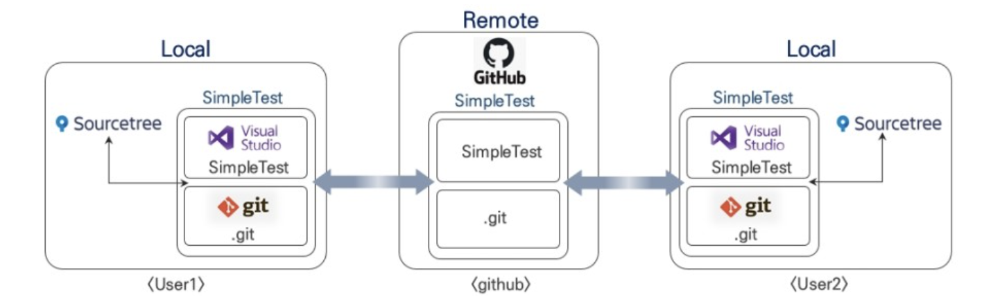
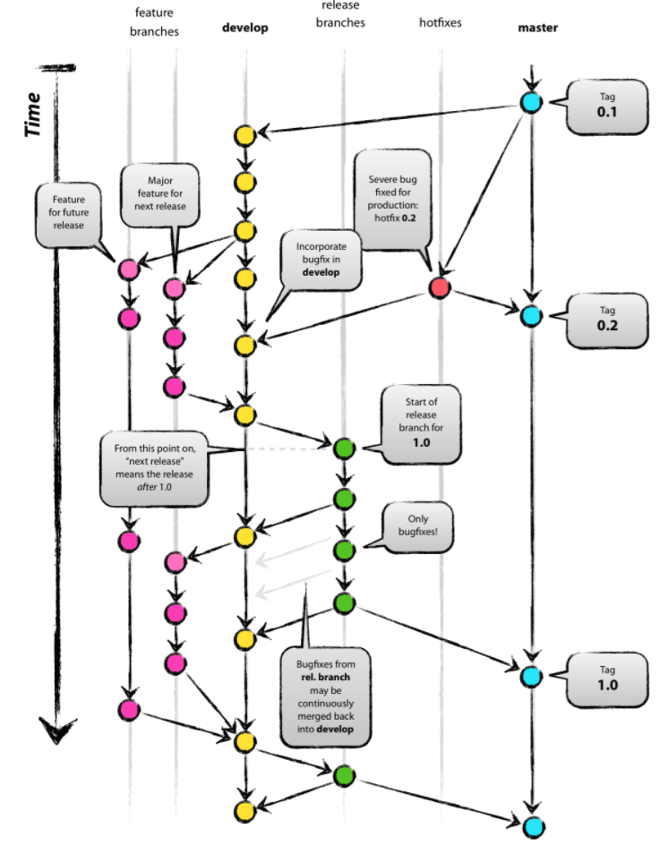
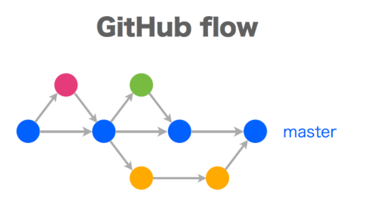
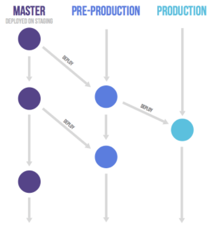
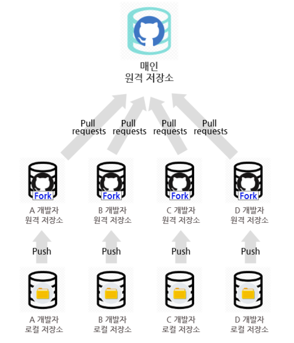

## Git

### git, github
#### git
* git이란 컴퓨터 파일의 변경 사항을 추척하고 파일들의 작업을 조율하는 분산 버전관리 시스템이다.
* 코드를 관리하고 기록하고 버전 관리를 해주므로 체계적인 개발이 가능하도록 도와주는 무료 공개 소프트웨어이다.
* git을 사용하면 개발자들이 효율적으로 협업하고 소스코드를 관리할 수 있다.
<br>
#### github
* Git 저장소를 관리하는 클라우드 기반 호스팅 서비스 이다.
* git 저장소를 호스팅 하고 웹 상에서 소스코드를 관리, 공유, 협업할 수 있다.
* 프로젝트 관리를 위한 다양한 기능을 제공하며, 이슈 트래킹, 웹 인터페이스를 통한 코드 검토, 프로젝트위키, 그리고 CI/CD와 같은 지속적 통합 및 배포 기능을 제공한다.
* 클라우드 서버에 소스를 올리기 때문에 한 프로젝트에 여러 명의 사람이 참여하여 버전 제어 및 공동 작업이 가능하다.
<br>

### Git과 Github의 차이점

* git은 remote 저장소를 지원하는 형상관리 도구이며,
* github가 바로 git에서 지원하는 remote 저장소 이다.
* git은 본인의 코드와 수정 내역을 기록하고 관리하는 버전 관리 프로그램으로써 브랜치를 생성하고 복구 삭제 병합하며 작업이 가능하다.
* 하지만 로컬 저장소를 사용하기 때문에 다른 사람과 실시간 협업 및 작업 공유가 불가능하다.
* 하지만 이때 깃허브를 사용하면 공동 작업이 가능하다.

### Git 명령어
```bash
git init
```
* 현재 디렉토리를 Git 저장소로 초기화 한다.
* 이 명령어를 실행하면 해당 디렉토리에 '.git' 디렉토리를 생성하여 버전 관리를 시작한다.
<br>

```bash
git clone [URL]
```
* 원격 저장소에서 프로젝트를 복제합니다.
* URL은 Github, GitLab 등에서 제공되는 저장소 주소이다.
<br>

```bash
git add [파일명]
```
* 파일을 스테이징 영역에 추가한다.
* 스테이징 영역은 변경 내용을 커밋할 준비가 된 파일들의 집합을 의미한다.

```bash
git commit -m "커밋 메세지"
```
* 스테이징 영역에 있는 변경 사항을 커밋하여 저장소에 영구적으로 기록한다.
* '-m' 옵션을 사용하여 커밋 메세지를 직접 지정할 수 있다.
<br>

```bash
git push
```
* 로컬 저장소의 변경 사항을 원격 저장소로 업로드한다.
<br>

```bash
git pull
```
* 원격 저장소의 변경 사항을 로컬 저장소로 가져온다. 
* 'git fetch'와 'git merge'의 단축 명령어로 볼 수 있습니다.
<br>

```bash
git branch
```
* 현재 저장소에 있는 브랜치 목록을 확인합니다.
* '-r' 옵션을 사용하면 원격 브랜치 목록을 확인할 수 있습니다.

```bash
git checkout[브랜치명 또는 커밋 해시값]
```

* 지정된 브랜치로 이동하거나, 특정 커밋 상태로 되돌아갑니다.

```bash
git merge[브랜치명]
```
* 다른 브랜치의 변경 사항을 현재 브랜치에 병합한다.

```bash
git log
```
* 커밋 로그를 조회한다.
* 저장소의 모든 커밋 기록을 보여준다.

```bash
git status
```
* 현재 작업 디렉토리의 상태를 확인한다.
* 스테이징 영역에 추가된 파일이 있는지, 변경된 파일이 있는지 등을 보여준다.

---
### github 협업의 기초

### Git Branch 전략
#### 1. gitflow
##### gitflow에 존재하는 5가지 브랜치
>   - master: 기준이 되는 브랜치로 제품을 배포하는 브랜치이다.
>   - develop: 개발 브랜치로 개발자들이 이 브랜치를 기준으로 각자 작업한 기능들을 Merge를 한다.
>   - feature: 단위 기능을 개발하는 브랜치로 기능 개발이 완료되면 develop 브랜치에 Merge를 한다.
>   - release: 배포를 위해 master 브랜치로 보내기 전에 먼저 QA(품질검사)를 하기위한 브랜치이다.
>   - hotfix: master 브랜치로 배포를 했는데 버그가 생겼을 때 긴급 수정하는 브랜치이다.

* master와 develop가 중요한 매인 브랜치이고 나머지는 필요에 의해서 운영하는 브랜치이다.
* branch를 merge할 때 항상 -no-ff 옵션을 붙여 branch에 대한 기록이 사라지는 것을 방지하는 것을 원칙으로 한다.

##### gitflow 과정
>   - master 브랜치에서 develop 브랜치를 분기한다.
>   - 개발자들은 develop 브랜치에 자유롭게 커밋을 한다.
>   - 기능 구현이 있는 경우 develop 브랜치에서 feature-* 브랜치를 분기한다.
>   - 배포를 준비하기 위해 develop 브랜치에서 release-* 브랜치를 분기한다.
>   - 테스트를 진행하면서 발생하는 버그 수정은 release-* 브랜치에 직접 반영한다.
>   - 테스트가 완료되면 release 브랜치를 master와 develop에 merge한다.

<br>

#### 2. github flow
* git-flow가 github에서 사용하기에는 복잡하다고 나온 브랜치 전략이다.
* hotfix 브랜치나 feature 브랜치를 구분하지 않는다. 다만 우선순위가 다를 뿐
* 수시로 배포가 일어나며, CI와 배포가 자동화되어있는 프로젝트에 유용

>   사용법<br>
>   1. master 브랜치는 어떤 때든 배포가 가능하다
>   - master 브랜치는 항상 최신 상태며, stable 상태로 product에 배포되는 브랜치이다.
>   - 이 브랜치에 대해서는 엄격한 role과 함께 사용한다.
>   - **merge하기 전에 충분히 테스트를 해야한다. 테스트는 로컬에서 하는 것이 아니라 브랜치를 push하고 Jenkins로 테스트 한다.**
>   2. master에서 새로운일을 시작하기 위해 브랜치를 만든다면, 이름을 명확히 작성해야한다.
>   - **브랜치는 항상 master 브랜치에서 만든다.**
>   - Git-flow와는 다르게 feature 브랜치나 develop 브랜치가 존재하지 않는다.
>   - 새로운 기능을 추가하거나, 버그를 해결하기 위한 브랜치 이름은 자세하게 어떤 일을 하고 있는지에 대해서 작성해주어야 한다.
>   - **커밋메시지를 명확하게 작성해야한다.**
>   3. 원격지 브랜치로 수시로 push 해야한다.
>   - Git-flow와 상반되는 방식이다.
>   - 항상 원격지에 자신이 하고 있는 일들을 올려 **다른 사람들도 확인할 수 있도록 해준다.**
>   - 이는 하드웨어에 문제가 발생해 작업하던 부분이 없어지더라도, **원격지에 있는 소스를 받아서 작업할 수 있도록 해준다.**
>   4. 피드백이나 도움이 필요할 때, 그리고 merge 준비가 완료되었을 때는 pull request를 생성한다
>   - **pull request**는 코드 리뷰를 도와주는 시스템이다.
>   - 이것을 이용해 **자신의 코드를 공유하고, 리뷰받을 수 있다.**
>   - merge 준비가 완료되었다면 **master 브랜치로 반영**을 요구할 수 있다.
>   6. master로 merge되고 push 되었을 때는, 즉시 배포되어야한다.
>   - GitHub-flow의 핵심이다.
>   - **master로 merge가 일어나면 자동으로 배포**가 되도록 설정해놓는다 

<br>

#### 3. gitlab flow 
* Gitlab에는 **Production 브랜치**가 있는데, 이는 Gitflow의 **Master브랜치역할과 같다**.
* Gitlab flow의 Master브랜치는 Production 브랜치로 병합한다.
* production 브랜치는 오직 **배포만을 담당**한다.
* **pre-production 브랜치**는 production 브랜치로 결과를 넘기기 전에 **테스트를 수행**하는 브랜치이다.
* Production브랜치에서 릴리즈된 코드가 **항상 프로젝트의 최신버전 상태를 유지해야할 필요가 없다**는 장점
* 복잡한 Gitflow와 너무 간단한 Github의 절충안

<br>

#### 4. Fork와 Pull Request
* 규모가 있는 개발을 할 경우 브랜치 보다는 Fork와 Pull requests를 활용하여 구현을 한다.
* Fork는 브랜치와 비슷하지만 프로젝트를 통째로 외부로 복제해서 개발을 하는 방식이다.
* 개발을 해서 브랜치처럼 Merge를 바로 하는 것이 아니라 Pull requests로 원 프로젝트 관리자에서 머지 요청을 보내면 원 프로젝트 관리자가 Pull requests된 코드를 보고 적절하다 싶으면 그때 그 기능을 붙히는 식으로 개발을 진행한다.

<br>