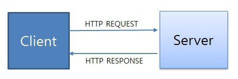

# HTTP

### HTTP란
* HTTP는 텍스트 기반의 통신 규약으로 인터넷에서 데이터를 주고받을수 있는 프로토콜이다. 
* 월드 와이드 웹의 토대이며 하이퍼텍스 링크를 사용하여 웹 페이지를 로드하는 데 사용된다. 
* HTTP를 통한 일반적인 흐름에는 클라이언트 시스템에서 서버를 요청한 다음 서버에서 응답 메세지를 보내는 작업이 포함된다 

### HTTP 특징
* HTTP 메세지는 HTTP 서버와 HTTP 클라이언트에 의해 해석이 된다.
* TCP/ IP를 이용하는 응용 프로토콜이다. 
(인터넷에 통신망을 통해 데이터를 주고받는 기능을 이용한 응용 프로토콜)
* HTTP는 연결상태를 유지하지 않는 비연결성 프로토콜이다. 
(Cookie 와 Session이 해결해줄수있다.)
* 연결을 유지하지 않는 프로토콜이기 때문에 응답/요청 방식으로 동작한다. 
 

### HTTP 동작
* 사용자가 요청(request)을 하면 응답(responese)하는 형태로 동작
* 요청 : client -> server | 응답 : server -> client 
* 클라이언트가 HTML 또는 JSON등 받고싶은 형태를 명시해준다.

### HTTP 속성 (Stateful 과 Stateless )
#### Stateful (상태 유지)
* Stateful 프로토콜은 클라이언트와 서버 간의 통신 과정에서 상태를 유지한다. 
* 클라이언트의 상태 정보를 서버가 유지하고 있어야 한다. 이는 일반적으로 세션 상태를 유지하거나 쿠키를 사용하여 구현될 수 있다. 
* 서버는 클라이언트의 요청에 대해 이전 상태에 따라 다르게 응답할 수 있다. 
#### 장점
* 상태 정보를 유지하기 때문에 세션 관리에 용이하다.
* 서버가 클라이언트의 상태를 알고 있기 때문에 클라이언트에 대한 맞춤형 서비스를 제공할 수 있다.
* 서버가 클라이언트의 이전 동작에 대해 알고 있기 때문에 효율적인 오류 처리와 복구가 가능하다.
#### 단점
* 상태 정보를 유지하기 위해 서버가 리소스를 소비하므로 확장성이 낮을 수 있다.
* 클라이언트가 중단되거나 재시작할 때 세션 정보의 일관성을 유지하기 어려울 수 있다.
* 상태 정보가 유출되면 보안 문제가 발생할 수 있다.

#### Stateless (상태 비유지)
* Stateless 프로토콜은 클라이언트와 서버 간의 통신 과정에서 상태를 유지하지 않는다.
* 각각의 요청은 서로 독립적이며, 이전 요청과 관련된 정보를 서버가 기억하지 않는다.
* 각각의 요청은 완전히 독립적으로 처리된다. 따라서 서버는 클라이언트의 이전 상태에 대해 알지 못하고 동일한 요청에 대해 항상 동일한 방식으로 응답한다.

#### 장점
* 서버가 클라이언트의 상태를 유지하지 않으므로 확장성이 높다.
* 상태를 유지하지 않기 때문에 서버 측에서 더 적은 메모리를 사용하고 관리할 필요가 있다.
* 클라이언트가 중단되더라도 서버는 아무런 영향을 받지 않는다.

#### 단점
* 클라이언트의 이전 상태를 알 수 없으므로 맞춤형 서비스 제공이 어려울 수 있다.
* 세션 관리 및 사용자 추적과 같은 작업에 대한 추가 작업이 필요할 수 있다.
* 클라이언트가 매번 모든 정보를 제공해야 하므로 트래픽이 증가할 수 있다.

### HTTP 메서드 ( GET, POST, PUT, DELEDT )

#### GET:
* 서버로부터 리소스를 요청한다.
* 웹 페이지를 요청하거나 데이터를 검색할때 주로 사용된다.
* 보통 URL에 쿼리 매개변수를 사용하여 데이터를 전달합니다.

#### POST:
* 서버에 새로운 데이터를 전송한다.
* 폼 데이터를 서버로 제출할 때 주로 사용된다.
* HTTP 본문에 데이터를 포함하여 전송한다.

#### PUT:
* 서버에 새로운 리소스를 생성하거나 기존 리소스를 업데이트한다. 
* 요청 본문에 업데이트할 데이터를 포함하여 전송된다.

#### DELETE:
* 서버에서 리소스를 삭제한다.
* 요청된 URI에서 식별된 리소스를 제거힌다.

### HTTP 메시지 및 웹 브라우저의 동작 흐름

#### HTTP 메시지:
* HTTP 메시지는 클라이언트와 서버 간의 통신을 위한 데이터의 형식입니다.  
* HTTP 메시지는 요청(Request)과 응답(Response) 두 가지 형태가 있다. 
* HTTP 요청 메시지는 클라이언트에서 서버로 보내는 메시지로, 요청 라인, 헤더, 본문(body)으로 구성된다.  
* HTTP 응답 메시지는 서버에서 클라이언트로 보내는 메시지로, 상태 라인, 헤더, 본문으로 구성된다. 

#### 웹 브라우저 동작 흐름:
#### 요청 단계:
* 사용자가 웹 브라우저에 URL을 입력하거나 링크를 클릭한다. 
* 브라우저는 URL을 기반으로 HTTP 요청 메시지를 생성한다. 
* 요청 메시지에는 요청 라인(GET, POST 등), 헤더(사용자 에이전트 정보, 쿠키 등), 요청 본문(POST 요청 시에만)이 포함된다. 
* 요청 메시지가 완성되면, 브라우저는 해당 요청을 웹 서버로 전송한다.
#### 응답 단계:
* 서버는 요청을 받고, 요청에 대한 적절한 응답 메시지를 생성한다. 
* 응답 메시지에는 상태 라인(상태 코드와 설명), 헤더(콘텐츠 타입, 캐시 제어 등), 응답 본문(HTML 페이지, 이미지 등)이 포함된다. 
* 서버가 응답 메시지를 완성하면, 해당 메시지를 클라이언트(웹 브라우저)로 전송한다. 
#### 페이지 렌더링:
* 브라우저는 응답 메시지를 받으면, HTML 페이지를 해석하고 렌더링한다. 
* HTML 문서에는 텍스트, 이미지, 링크, 스크립트 등 다양한 요소가 포함될 수 있다. 
* 브라우저는 HTML 문서를 파싱하고, 각 요소를 화면에 표시한다.  
* 필요한 경우 CSS 스타일 시트 및 JavaScript 코드도 실행한다. 
