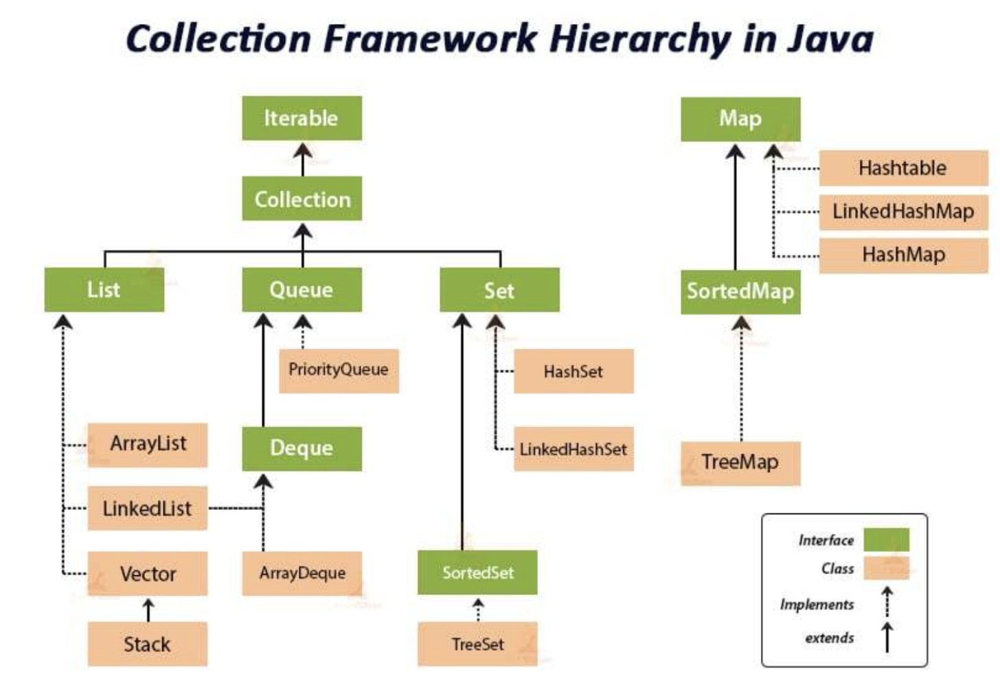
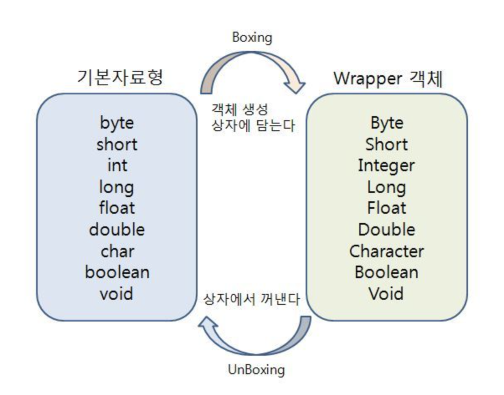

## JAVA

### 컬렉션 프레임 워크 (Collection Framework)

#### 컬렉션 (Collection)
* 여러 객체(데이터)를 담을 수 있는 자료구조, 다수의 데이터 그룹 또는 집합을 의미한다.

#### 프레임워크 (Framework)
* 복잡하게 설명할 수 있지만 간단하게 표준화된 프로그래밍 방식을 의미한다.

#### 컬렉션 프레임워크 (Collection Framework)
* 켈렉션 프레임워크란 데이터 그룹을 지정하는 클래스들을 표준화한 설계이다.
* 컬렉션 프레임워크를 활용하면 객체 지향적이고 재사용성이 높은 코드를 작성할 수 있다.
* JDK 1.2버전 부터 java.util 패키지에서 지원하기 시작하였고 이전에는 Vector, Properties, Stack, Hash Tables, Dictionary와 같은 것들이 존재하였으나 통일성이 없고 표준화된 인터페이스가 존재하지 않았다

#### CollectionFramework의 상속계층도



* 컬렉션 프레임워크의 주요 인터페이스로 List, Set, Map이 있다.
* List와 Set은 공통된 부분이 많아 둘의 공통 메서드만 모아서 새로운 인터페이스인 컬렉션으로 정의한다.
* Map은 List와 Set와 달리 키와 값을 쌍으로 관리하는 구조라서 독립된 인터페이스이다.
* 따라서 위 상속계층도 포함되지 못한다.

#### 인터페이스의 특징과 구현 클래스

#### 인터페이스 | 특징 | 구현클래스
* List | 순서유지, 저장, 중복저장 가능 | ArrayList, Vector, Stack, LinkedList 등
* Set | 순서유지, 저장, 중복저장 불가능 | HashSet, TreeSet 등
* Map | 키와 값은 쌍으로 저장, 순서 유지 불가능, 키 중복 저장 불가능 | HashMap, Hashtable, TreeMap, Properties 등


 #### 리스트 (List)
 * 순서가 있는 데이터 집합으로 데이터 **중복을 허용**한다.

 #### ArrayList
* 배열을 이용하여 만든 리스트로 대표적인 컬렉션 클래스이다.
* 기본 크기는 10이지만 원소가 늘어나면 더 큰 배열에 옮긴다.
* 특정 원소 조회수가 많은경우 사용하는 것이 좋다.
* 단반향 포인터 구조로 인덱스로 조회가 가능하다 때문에 인덱스만 안다면 빠르게 조회가 가능하디.

#### LinkedList
* 노드와 포인트를 이용하여 만든 리스트이다.
* 특정 원소를 조회하는 경우 첫 노드부터 순화해야 하기 때문에 ArrayList에 비해 느리다.
* 조회보다 삽입, 삭제가 많은 경우 사용하는 것이 좋다.
* 양방향 포인터 구조로 삽입, 삭제 시 포인터를 끊고 새로운 노드에 연결만 하면 됨으로 빠르다.
* 스택, 큐, 양방향 큐등을 만들기 위한 용도로 쓰인다.

#### Vector
* ArrayList와 비슷하게 배열로 만들어진 리스트로 과거의 대용량 처리를 위해 사용하였다.
* thread-safe 하다는 특징을 가지고 있어 비교적 성능이 좋지 않고 무거워 잘 쓰이지 않는다.

#### Stack
* LIFO(Last-In-First_Out) 특성을 가지는 자료구조이다.
* 들어올 때 Push, 나갈 때는 Pop이라는 용어를 사용한다.

---

#### 큐 (Queue)
* 처음 들어온 원소가 처음으로 나간다는 FIFO(First-In-First-Out)이라는 특징을 가진다.

#### PriorityQueue
* 우선순위를 가지는 큐로 들어온 순서가 아닌 부여된 우선순위에 따라 높은 순으로 먼저 반환한다.

#### Deque
* 양쪽으로 넣고 빼는 것이 가능한 큐 자료구조이다.

---

#### 집합 (Set)
* 순서가 없는 데이터 집합으로 데이터 중복을 허용하지 않는다.

#### HashSet

* 가장 빠른 임의 접근 속도를 가진다.
* 객체를 저장하기 전에 먼저 객체의 hashCode() 메서드를 호출하고 같다면 equals()로 두 객체를 비교하여 동등성을 판단한다.

#### LinkedHashSet

* 중복을 허용하진 않지만 순서를 가진다.

#### TreeSet

* 중복을 허용하지 않고 순서도 없다. 그러나 정렬이 되어있다.
* 이진트리를 기반으로한 Set 컬렉션이다.

#### 맵(Map)

* Key-Value 쌍으로 이루어진 데이터의 집합으로 순서는 유지되지 않으며 키(Key)의 중복을 허용하지 않으나 값(Value)의 중복은 허용한다.

#### HashMap

* HashMap과 동일한 특징을 가지지만 thread-safe 하여 동기화를 지원한다.
* get(), put(), remove() 등에 sycronized라는 키워드가 붙어있다.

#### LinkedHashMap

* 들어온 순서대로 순서를 가지는 Map이다.

#### TreeMap

* 키를 기준으로 정렬이 되어 저장되는 Map이다.
* 이진트리를 기반으로 한 Map이다. 부모 키값을 비교하여 낮은 건 왼쪽 높은 건 오른쪽에 Map.Entry를 저장한다.
* 저장시간이 다른 자료 구조에 비해 오래 걸린다. 

---

#### Wrapper Class(래퍼 클래스)

* 자바의 기본 타입을 클래스 화한 변수형 객체로써 변수를 객체처럼 활용하기 위해 사용된다.
* int, double, boolen등은 객체가 아니다 그러므로 객체로 다루어야 할 때 사용한다.
* 예를 들어, 객체 기반의 컬렉션에서 기본 데이터 유형을 사용하기위해 Wrapper클래스를 사용한다.
* 래퍼 클래슨느 각각의 타입에 해당하는 데이터를 인수로 전달받은 후, 해당 값을 가지는 객체로 만들어 준다.
* 즉 기본 타입을 객체 형태로 '포장'하는 것을 의미한다.
* 로직이 필요하거나 컬렉션, 제네릭 활용으로 타입 안정성을 보장하기 위해서 사용된다.
* 넓은 범위의 유틸리티 메서드를 활용할 수 있다.
* java.lang 패키지에서 제공된다.


#### 기본타입 | 래퍼 클래스

byte | Byte

short | Short

int | Interger

long | Long

float | Float

double | Double

char | Character

boolean | Boolean



#### Boxing (박싱) 과 Unboxing (언박싱)

* Primitive type과 Wrapper class는 상호 변환이 이루어지는데, 이러한 과정을 Boxing과 Unboxing이라고 한다.
* Java 5부터 도입되었으며, 기본 데이터 유형과 래퍼 클래스 간의 변환 작업을 보다 편리하게 해주는 역할을 한다.

#### Boxing (박싱)

* 기본 타입에서 wrapper 클래스로 전환한다.
* 기본 데이터 유형의 값이 래퍼 클래스의 객체로 필요한 곳에 사용될 때 자동으로 박싱이 발생한다.

#### Unboxing (언박싱)

* wrapper 클래스 객체를 기본 타입으로 전환한다.
* 래퍼 클래스의 객체가 기본 데이터 유형이 필요한 곳에 사용될 때 자동으로 언박싱이 발생한다.
* "(자료형)Value()" 메서드를 사용해 언박싱을 할 수 있다.


#### Auto Boxing (오토 박싱)과 Auto Unboxing (오토 언박싱)

* JDK 1.5부터 박싱과 언박싱이 필요한 상황에서 자바 컴파일러가 이를 자동으로 처리해 준다.

Ex)


```bash
// Boxing and Unboxing

Integer num = new Interger(17); // 박싱
int n = num.intValue(); // 언박싱

------------------------------------------

// AutoBoxing and AutoUnboxing

Integer num = 17 // Integer num = new Integer(17); : 오토박싱
int n = num; // int n = num.intValue(); // 오토언박싱
```

* 오토 박싱을 이용하면 new키워드를 사용하지 않고도 자동으로 인스턴스를 생성할 수 있다.  
* 래퍼 클래스도 객체이기 때문에 동등 연산자를 사용하게 되면, 두 인스턴스의 값을 비교하는 것이 아니라 두 인스턴스의 주소값을 비교한다.
