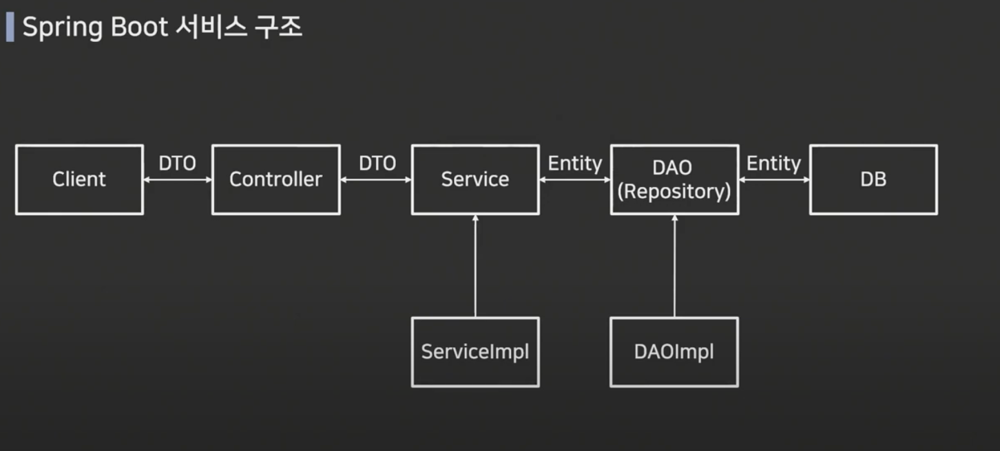

### Spring, SpringBoot

#### Spring Framework
* Java 기반의 오픈소스 Back=end 프레임워크 이다.
* Java 애플리케이션을 구축하기 위한 종합적인 프레임워크 이다.
* 주로 엔터프라이즈급 애플리케이션을 만들 때 사용되며, 중속성 주입(Dependency Injection)과 관점 지향 프로그래밍과 같은 핵심 기능을 제공한다.
* Spring은 다양한 모듈로 구성되어 있어서 웹 개발부터 데이터 액세스, 보안, 트랜잭션 관리등 다양한 영역에서 사용할 수 있다.

#### Spring Framework를 사용하는 이유 및 장점

* 경량화와 모듈화
>   * 경량화된 구조를 가지고 있으며 필요한 기능을 모듈화하여 제공한다. 
>   * 이는 개발자가 필요한 모듈만 선택하여 사용할 수 있고, 필요한 경우 다른 모듈로 쉽게 확장할 수 있다는 장점을 제공한다.

* 의존성 주입
>   * Spring은 의존성 주입을 통해 객체 간의 결합도를 낮추고 코드의 재사용성을 높인다.
>   * 이는 객체 간의 의존성을 외부에서 주입받기 때문에 유닛 테스트 작성이 용이하며, 코드의 유지보수성을 향상시킨다.

* 관점 지향 프로그래밍
>   * Spring은 AOP를 지원하여 횡단 관심사를 분리하여 관리할 수 있다. 
>   * 이는 예를 들어 로깅, 트랜잭션 관리, 보안 등과 같은 부가적인 기능을 모듈화하여 중복을 줄이고 코드의 가독성을 높인다.

* 트랜잭션 관리
>   * Spring은 트랜잭션 관리를 지원하여 데이터베이스와 같은 리소스의 일관성을 보장한다. 
>   * 이는 애플리케이션에서 발생하는 데이터 변경 작업을 안전하게 처리할 수 있도록 도와준다.

* 웹 개발 지원
>   * Spring은 Spring MVC와 같은 모듈을 통해 웹 애플리케이션 개발을 지원한다. 
>   * 이는 웹 요청과 응답 처리를 위한 강력한 기능을 제공하며, RESTful 웹 서비스를 구축하는 데도 도움이 된다.

* 커뮤니티 및 생태계
>   * Spring은 거대한 개발자 커뮤니티와 활발한 생태계를 가지고 있습니다. 
>   * 이는 문제 해결에 도움을 받을 수 있는 수많은 자료와 라이브러리가 존재한다는 것을 의미합니다.

#### Spring Framework의 특징
 
#### DI(Dependency Injection)
* 의존성을 주입하면서 객체간 결합을 느슨하게 하는 것
* 결합이 느슨해지면 코드의 재사용성이 증가하고, 단위 테스트가 용이해진다.

#### IoC(Invension of Control)
* 컨트롤의 제어권이 프레임워크에게 있는것을 말함다.
* Servlet이나 Bean같은 코드를 개발자가 직접 작업하지 않고, 프레임 워크가 대신 수행한다

#### AOP(Aspect Oriented Programming)
* 핵심기능을 제외한 부수적인 기능을 프레임워크가 제공한다.
* 예를 들어 Spring 프로젝트에 security를 적용하거나, logging등을 추가하고 싶을 때 기존 비지니스 로직을 건들이지 않고 AOP로 추가할 수 있다.

#### 중복 코드 제거
* JDBC 같은 템플릿을 사용할때 중복되는 코드도 많고 복잡한데 이를 모두 제거해 준다

#### 다른 프레임워크와의 통합
* JUnit, Mockito와 같은 유닛 테스트 프레임워크와 통합이 가능하다
* 이를 통해 개발하는 프로그램의 품질이 향상된다.

#### Spring Boot
* Spring Boot는 Spring 기반의 애플리케이션을 빠르고 쉽게 개발할 수 있도록 도와주는 프레임워크이다.
* Spring Boot는 애플리케이션을 빌드하고 구성하는 데 필요한 많은 설정을 자동화하여 개발자가 빠르게 시작할 수 있도록 한다.
* 내장된 서버를 사용하여 애플리케이션을 실행할 수 있고, 간단한 설정으로 모니터링 및 관리 기능을 추가할 수 있다.

#### Spring Boot Framework와 Spring Framework의 차이점
* 스프링 부트는 단독적이고, 상용화 수준의, 스프링 기반 애플리케이션을 단지 실행할 수 있을 정도로 쉽게 만들수 있다.

#### 1. Dependency

* SpringFramework의 경우 dependency를 설정해줄 때 설정 파일이 매우 길고, 모든 dependency에 대해 버전 관리도 하나하나 설정 해 주어야 한다
* SpringBootFrmework의 경우 dependency를 Spring Framework보다 쉽게 설쟁해 줄 수 있다, 버전관리도 자동으로 해준다.
* 빌드 툴을 Gradle을 사용하는 경우 build.gradle파일에 dependency를 추가해주면 Spring Boot로 웹 개발을 할 때 필요한 모든 dependency를 자동으로 추가하고 관리해줍니다.
* pring Framework의 경우 test프레임워크를 사용하고자 하는 경우 Spring Test, JUnit, Hamcrest, Mockito 등 모든 라이브러리를 추가해줘야 하지만, Spring Boot에서는 spring-boot-starter-test 만 추가해주면 됩니다.

#### 2. Configuration

* Spring Framework의 경우 configuration설정을 할 때도 매우 길고, 모든 어노테이션 및 빈 등록 등을 설정해 줘야 한다.
* Spring Boot Framework는 application.properties파일이나 application.yml파일에 설정하면 된다.
* Spring Boot의 강력한 AutoConfiguration
>   * Spring Frame와 달리 Spring Boot에는 AutoConfiguration이라는 것이 있다.
>   * Spring Boot로 실행할 수 있는 애플리케이션을 만들기 시작하면 클래스에 @SpringBootApplication이라는 어노테이션을 확인할 수 있다.
>   * 이 어노테이션을 제거하고 프로그램을 실행하면, 일반적인 자바 프로그램과 동일하게 실행됩니다.
>   * 해당 어노테이션 덕분에 많은 외부 라이브러리, 내장 톰캣 서버 등이 실행될 수 있습니다.

* @ComponentScan
>   * @Component, @Controller, @Repository, @Service라는 어노테이션이 붙어있는 객체들을 스캔해 자동으로 Bean에 등록해준다.

* @EnableAutoConfiguration
>   * @ComponentScan 이후 사전에 정의한 라이브러리들을 Bean에 등록해준다.
>   * 사전에 정의한 라이브러리들은 다음 경로에서 확인할 수 있다.
>   * 하지만 사전에 정의한 라이브러리라고 전부 Bean에 등록되진 않는다.
>   * EnableAutoConfiguration을 키로 하는 외부 의존성들을 확인할 수 있습니다. 
>   * 이 의존성들을 모드 스캔하며 조건에 따라 의존성을 주입해 줍니다.

#### 3. 편리한 배포
* Spring Framework로 개발한 애플리케이션의 경우, war파일을 Web Application Server에 담아 배포할수 있다.
* Spring Boot Framework의 경우, Tomcat 이나 Jetty 같은 내장 WAS를 가지고 있기 때문에 jar 파일로 간편하게 배포할 수 있다.
* Spring Framework로 WAS를 정하고, 모든 설정을 마쳐 배포를 하는 것보다 훨씬 간단한 배포 방법이다.

---

#### DAO, DTO, VO, Entity 개념 및 차이점



#### DAO(Data Access Object)

* DB의 data에 접근하기 위한 객체로 직접 DB에 접근하여 데이터를 삽입, 삭제, 조회 등 조작할 수 있는 기능을 수행한다.
* DataBase 접근을 하기 위한 로직과 비지니스 로직을 분리하기 위해 사용한다.
* DAO는 Database와 연결할 Connection까지 설정되어 있는 경우가 많으며 현재는 커넥션풀이 제공되고 있어서 DAO를 별도로 만드는 경우는 드물다.
* repository와 DAO는 비슷한 개념이다.
* repository는 Entity 객체를 보관하고 관리하는 저장소, DAO는 데이터에 접근하도록 * DB접근 관련 로직을 모아둔 객체이다.

#### 사용이유
* 효율적인 커넥션 관리와 보안성.
* DAO는 비지니스 로직을 분리하여 도메인 로직으로부터 DB와 관련한 매커니즘을 숨기기 위해 사용.

##### UserDao 인터페이스

```java
public interface UserDao {
	void save(User user);
    List<User> findAll();
    void update(User user);
    void delete(int id);
}
```


```java
@Repository
public class UserDaoJdbc implements UserDao {
	
    @Override
    public void save(User user){
    	...
    }
    
    @Override
    public List<User> findAll() {
    	...
    }
    
    @Override
    public void update(User user) {
    	...
    }
    
    @Override
    public void delete(int id) {
    	...
    }
}
```

#### DTO(Data Transfer Object)

* DTO는 계층 간(Controller, View, Business Layer) 데이터 교환을 위한 자바 빈즈(Java Beans)를 의미한다.
* DB에서 가져온 데이터를 다른 계층에서 사용하기 적합한 형식으로 변환하여 전송하는 데 사용한다.
* response / request에서 사용할 수 있다.
* DTO(Data Transfer Object)는 데이터 전송(이동) 객체라는 의미를 가지고 있어 주로 비동기 처리를 할 때 사용한다.
#### 특징

* DTO는 로직을 가지지 않는 데이터 객체이고 getter/setter 메서드만 가진 클래스를 의미한다.

#### 사용이유

* 다른 계층 또는 시스템으로 쉽게 전송할 수 있어 효율적으로 전송하고 관리할 수 있다.
* 관련된 데이터를 하나의 객체로 묶어 캡슐화하기 때문에 데이터의 구조를 단순화하고 관리하기 쉽게 만든다.
* 필요한 데이터만 포함하고 있기 때문에 불필요한 데이터 전송을 방지할 수 있다.

##### Ex)
>   모든 회원 정보를 불러와야 한다고 가정하자. User Table에는 회원의 이름, 성별, 나이, 핸드폰번호, 아이디, 비밀번호 등 많은 정보들이     존재한다. 하지만, 나는 이름, 성별, 나이만 필요하다. User Table에 모든 데이터가 필요하지 않은 지금, Entity로 만들어 둔 class를 사용하기에는 보안상의 문제, 필요 없는 값을 가지고 있다는 점에서 좋지 않다. 이런 경우, 이름, 성별, 나이만 담는 DTO를 만들어 사용하자.<br>

```java
@Getter
@NoArgsConstructor
@AllArgsConstructor
public class CreateBoardRequest {
	
    @NoBlank
    private String titlel
    @NoBlank
    private String content;
    @NoBlank
    private String createdBy;
    
}
```

#### + 자바 빈즈(Java Bean)
* 특정한 정보 (id, password, name, job...)등을 가지고 있는 클래스를 표현하는 하나의 규칙이고, 데이터를 표현하기 위한 목적을 지니고 있다.
* 이 규칙을 지닌 클래스를 Java Bean 이라고 함.

#### 규칙
* 반드시 클래스는 패키지화 되어야 한다.
* 멤버변수는 property(프로퍼티)라고 한다.
* 멤버변수는 private로 지정하고, 외부접근을 위한 get, set 메소드를 정의해야 한다.
* get, set 메소드는 public으로 지정해야 한다.

#### 특징
* JavaBean property
>   * property는 JavaBean에 저장되어 있는 값을 나타내며, 메서드 이름을 사용해서 property 이름을 결정하게 된다. getter/setter 와 상응.
* Jsp:useBean 태그를 이용한 자바 객체 사용
>   * JSP페이지의 주요 기능 중 하나는 데이터를 보여주는 기능이다.
>   * JSP 에서는 이런 데이터를 JavaBean 클래스에 담아 값을 보여주는 것이 일반적이다.
* Java Bean은 쉽게 말해 MVC 패턴에서 데이터를 표현해주는 Model에서 사용하기 위한 표현의 형태.
* 상황에 따라 변수를 그때마다 생성해서 사용하면 효율이 떨어진다.
* 따라서 공통된 정보를 관리하는 기능에서 편리하게 사용하기 위해 규칙성 있는 형태로 데이터의 집합을 만든 것이다.
---

#### VO(Value Object)
* DTO와 동일한 개념이지만, Read Only의 속성을 지니고 있다.
* 자바에서 단순히 값 타입을 표현하기 위해 불변 클래스를 만들어 사용한다.
* VO의 핵심 역할은 equals()와 hashcode()를 오버라이딩 하는 것.

#### DTO vs VO
* DTO는 가변의 성격을 가진 클래스이며 데이터 전송을 위해 존재한다.
* 그의 반해 VO는 값 그 자체의 의미를 가진 불변 클래스를 의미한다.
* DTO는 인스턴스 개념이고, VO는 리터럴 값 개념이다.
* 두 객체의 모든 필드 값들이 동일하면 두 객체는 같다.
* 완전히 값 자체 표현 용도로만 사용하는 목적이기 때문이다.

Ex)

```java
public class Address {
	private String street;
    private String city;
    private String state;
    private Stirng postalCode;
    
    public Address(String street, String city, Stiring state, String postalCode) {
    	this.street = street;
        this.city = city;
        this.state = state;
        this.postalCode = postalCode;
    }
}
```

#### Entity

* 실제 DB 테이블과 매핑되는 클래스이며 Entity를 기준으로 테이블이 생성된다.
* 데이터를 전달하는 클래스로 사용하면 안 된다.
* Entity는 비지니스 로직을 포함할 수 있다.
* @Table, @ID, @Column 등의 어노테이션에 쓰인다.

#### Entity, DTO 분리 이유

* 단순 테스트가 아닌 실제 프로젝트를 작성할 경우 Entity 객체를 영속 계층 바깥쪽에서 사용하는 방식보다는 DTO를 이용하는 방식을 권장
* DTO는 Entity 객체와 달리 각 계층끼리 주고받는 우편물이나 상자의 개념
* 순수하게 데이터를 담고 있다는 점에선 Entity 객체와 유사하지만, 목적 자체가 데이터의 전달이므로 읽고, 쓰는 것이 모두 허용되는 점이 가능하고 일회성으로 사용되는 성격이 강하다.
* JPA를 이용하게 되면 Entity 객체는 단순히 데이터를 담는 객체가 아니라 실제 데이터베이스와 관련이 있고, 내부적으로 EM이 관리하는 객체
 
Ex)

```java
@Entity
@NoArgsConstructor(access = AccessLevel.PROTECTED)
@AllArgsConstructor
@Getter
@Builder
public class Board {
	@ID
    @GeneratedValue(strategy = GenerationType.IDENTITY)
    private Long id;
    
    @Column(nullable = faluse)
    private String title;
    @Column(nullable = false)
    private String content;
    @Column(nullable = false)
    private String createdBy;
    
    pulic void updateBoard(String title, String content) {
    	this.title = title;
        this.content = content;
    }
}
```

#### record

* 불변 데이터를 표현하는 데 사용한다.
* 클래스이므로 interface 구현, extends 가능하다.
* constructor / getter 메서드를 컴파일러가 자동생성 해준다.

```java
public record ReadBoardsResponse(Long id, String title, String createBy){}
```