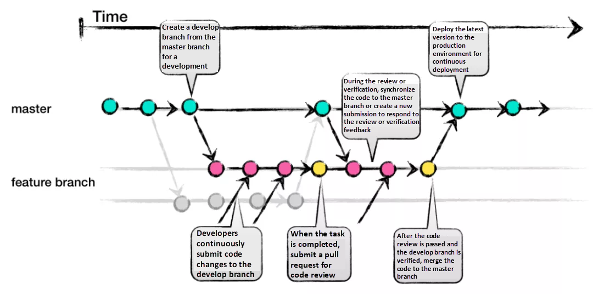

# 온보딩 2차 과제


## Git이란

git은 파일의 변경 내용을 저장 및 추적하는 버전 제어 시스템 입니다.

git은 특히 여러명이 함께 동일한 파일을 변경할 때 유용 합니다.

## Github란
github는 git 저장소를 올려두는 클라우드 서비스 입니다.
다른사람과 함께 코드를 작성하고 저장하며 공유할 수 있습니다.

#### Github를 사용하면 좋은점 = 협업
Github에 코드를 올리면 할 수 있는 것
+ 코드를 쇼케이스 및 공유
+ 다른 사람의 코드 리뷰 및 기여
+ 프로젝트의 안전 걱정없이 통합 및 업데이트
+ Github Actions를 통한 배포, 테스트등을 자동화

## Git 명령어

```bash
git init
```
현재 디렉토리에 .git폴더 생성
-> 깃 프로젝트 셋업

```bash
git add .
```
현재 디렉토리에 있는 모든 파일을
git stage에 올림.
이때 `.gitignore`에서 지정한 파일 및 폴더들은 무시된다.

```bash
git commit -m "commit message"
```
git stage에 올라가 있는 파일들을
커밋한다.
##### 커밋이란
저장소에 변경 사항을 기록하는것
스테이지에 올라가있는 파일들을 메세지와 함께 기록한다.

```bash
git branch -M main
```
git branch를 main으로 바꾼다.

```bash
git remote add origin https://github.com/wwwcomcomcomcom/TIL.git
```
git 원격 저장소를 origin이란 이름으로 저장한다.
```bash
git push origin main
```
`origin`원격 저장소의 `main` 브랜치로 변경사항을 올린다.

### git branch
```bash
git branch "새 브랜치명" "분기할 브랜치"
```
분기할 브랜치로부터 새 브랜치를 분기합니다.
```bash
git branch -D "삭제할 브랜치"
```
지정한 브랜치를 삭제합니다.
```bash
git branch -M "이전 이름" "새 이름"
```
브랜치의 이름을 변경합니다.
이전 이름은 선택 사항으로, 미 작성시,
작업중인 브랜치의 이름을 변경합니다.
ex)
```bash
git branch -M main
```

---

```bash
git checkout "브랜치 이름"
```
작업중인 브랜치를 이동합니다.
```bash
git switch "브랜치 이름"
```
역시나 작업중인 브랜치를 이동하지만,
checkout과 달리 로컬 브랜치에서만 작동합니다.

```bash
git merge "브랜치 이름"
```
지정한 브랜치의 변경사항이 작업중인 브랜치와 합쳐진다.


## Github Work Flow & Git Work Flow

### git flow
git flow 전략에선 5가지의 브랜치를 사용합니다.

+ feature : 기능개발
+ develop : 다음 출시버전 개발
    프로젝트에서 가장 최신의 버전
+ release : 이번 출시버전 개발
    QA를 위한 develop의 분기
+ hotfix : 출시버전에서 발생한 오류 수정
+ master : 제품으로 출시될 수 있는 브랜치
    안정성이 검증된 버전(QA 이후 release)


1. feature에서 기능개발을 한다.

2. 기능 개발후, develop에 merge한다.
develop에선 상시로 버그 수정 커밋이 올라온다.

3. 버전에 포함된 기능개발이 끝나면 develop에서
release로 merge한후 QA진행

4. QA가 끝난 release의 변경사항들을 master에 merge

5. master (배포 버전)에 문제가 생길시, hotfix브랜치에서 수정후
develop과 master에 동시에 merge

이와 같은 방법으로 git flow가 작동 된다.

### github flow

github flow는 git flow와 달리,
기본적으로 하나의 브랜치를 두고 작업합니다.
따라서 간단하게 버전을 관리하고 신속히 배포 할 수 있지만,
대규모 프로젝트에는 부적합합니다.

장점
> 간단하고 직관적인 구조
브랜치 충돌 최소화
지속적인 배포


단점
> 배포 위험성 -> 테스트와 검증 부족
배포 관리 어려움 -> 세부적인 배포 관리가 어려울 수 있음


기능 개발을 위해 새로운 브랜치를 만들고 그대로 master에 merge합니다.



1. 기능 개발 브랜치 생성
2. 커밋 작성
3. Pull Request
4. 코드리뷰, 피드백
5. 병합
6. 배포


## 공통

#### [코드 리뷰](code-review.md)
> 너무 길어진 관계로 분리했습니다.

#### Commit Convention -> 커밋 메세지 관습
커밋 메세지를 적는 관습을 말합니다.
개발자, 회사별로 세부사항은 다르지만 대부분
> 제목
본문
꼬리말

로 이루어져 있습니다.

이 섹션는 유다시티, Google/Angular의 커밋 컨벤션을 기준으로 작성되었습니다.

> type(scope) : subject
body
footer

형태를 기준으로 설명합니다.

type에는 커밋의 유형을 나타내고, 주로 사용되는 키워드는 다음과 같습니다.
+ feat : 새로운 기능 추가
+ fix : 버그 수정
+ docs : 문서 변경
+ style : 코드 스타일 변경
+ refactor : 코드 리팩토링
+ test : 테스트 코드 추가, 수정
+ chore : 빌드 프로세스, 도구 설정 변경 등 기타 작업

scope는 선택사항이며, 변경된 범위나 컴포넌트를 나타냅니다.

subject는 커밋의 제목을 나타냅니다.
50자 이내, 영문 표기시 대문자 시작을 원칙으 로 합니다.

body는 커밋의 내용을 나타냅니다.
각 줄은 72자를 넘기지 않습니다.
본문은 양에 신경쓰지 않고 최대한 상세히 작성합니다.
또한 어떻게 변경됐는지 보다 무엇을, 왜 변경했는지를 설명합니다.

footer는 선택사항이며 관련 이슈나 패치를 참조하기 위해 사용합니다.
이슈 트래커 id 또는 이전 커밋과 관련된 내용을 작성할 수 있습니다.

#### Branch Convention -> 브랜치 네이밍 관습