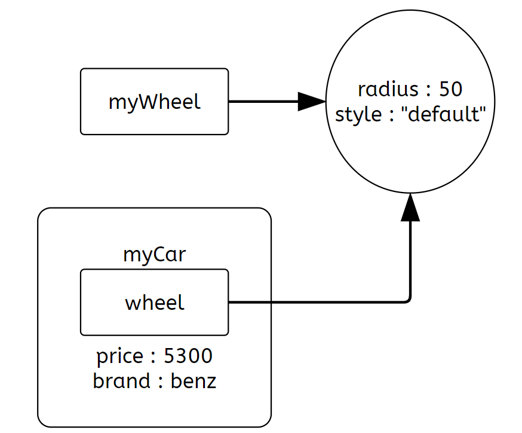

# Class - 클래스란?

객체를 생성하기 위한 틀, 설계도이다.
객체가 가지는 변수(필드)와 함수(메서드)로 이루어져 있다.

각각의 필드와 함수는 public이나 private중 하나의 속성을 가질 수 있으며
public은 외부에서 접근이 가능하고, private는 내부 메서드에서만 이용할 수 있다.

관례적으로 클래스의 첫 문자는 항상 대문자를 사용한다.

클래스의 부모(super class)가 있는경우 `extends [부모 클래스 이름]`이 붙습니다.

클래스는 하나의 부모 클래스만 확장할 수 있습니다.
```java
class MyClass extends SuperClass {
    //something
}
```

클래스에 의해 구현된 인터페이스가 있는경우 `implements [인터페이스 이름]`이 붙습니다.
이때, `extends`와 달리 클래스는 한번에 여러개의 인터페이스를 구현할 수 있습니다.
```java
class MyClass implements SomethingToImpl, MyInterface {
    //something
}
```

# Object - 객체란?

물리적으로 존재하거나 추상적으로 생각할 수 있는 모든 것.

-> 속성을 가지며, 다른것과 식별이 가능한 것

Java에서 객체는 클래스에 의해 정의되고, 정의된 내용을 기반으로 생성된다.

객체의 멤버로는 필드와 메서드, 이너클래스가 포함되며,

객체의 멤버는 '.'을 사용해 접근이 가능하다.

ex) `object.field`, `object.method()`

클래스를 통해 생성된 객체를 그 클래스의 인스턴스라고 한다.

```java
Wheel myWheel = new Wheel(50,"default");
Car myCar = new Car(myWheel,5300,"benz");
```

다음 상황에서 `myWheel` 인스턴스를 만들면서 jvm 메모리에 올라가면

`myCar`에선 `myWheel`을 복제하는 대신 참조하여, 메모리를 절약한다.

[참고한 오라클 문서](https://docs.oracle.com/javase/tutorial/java/javaOO/objectcreation.html)

# Instance - 인스턴스란?

객체와 인스턴스는 큰 차이가 있지 않고, 심지어 혼용하여 사용하기도 한다.

하지만 객체는 모든 인스턴스를 포괄하는 넓은 의미이고,

인스턴스는 해당 객체가 어떤 클래스로부터 생성된 것인지 나타내는것에 의미를 둔다.

`new` 키워드를 사용하여 클래스의 인스턴스를 만들 수 있다.
```java
Car myCar = new Car();
```

이와 밀접한 키워드가 `instanceof`이며 말 그대로 객체가 특정 클래스의 인스턴스인지를 나타낸다.

```java
"string" instanceof String  //true
```