# 컬렉션 프레임 워크

컬렉션 프레임워크란 데이터 그룹을 저장하는 클래스들을 표준화한 설계이다.

> 자주 쓰이는 자료 구조들을 Java 인터페이스와 클래스로 만들어 둔것.

컬렉션 프레임워크를 활용하면 객체 지향적이고 재사용성이 높은 코드를 작성할 수 있다.

### 컬렉션 프레임워크와 래퍼 클래스

컬렉션 프레임워크에 저장할 수 있는 데이터는 오로지 객체(Object) 뿐이다.

따라서 int형이나 double형 같은 타입은 저장할 수 없다.

따라서 해당 타입을 래퍼클래스로 감싸서, Integer 객체나 Double 객체로 저장하여야 한다. 

또한 종류에 따라 null 값을 저장할 수도 있습니다.

___

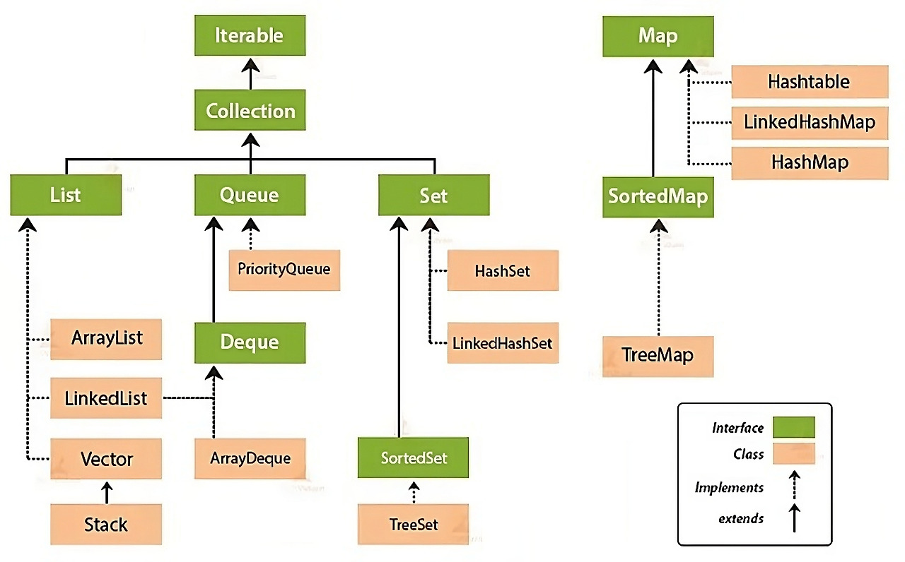

위 사진은 자바 컬렉션 프레임워크의 상속 계층도이다.

크게 Iterable과 Map으로 나누어 진다.

Iterable은 Array의 개념, Map은 Key-Value 형식의 자료 구조를 생각하면 쉽게 이해할 수 있다.


### Iterable
컬렉션 인터페이스들의 가장 최상위 인터페이스이다.

자료형의 순회가 필요할때 이용된다.
```java
default void forEach(Consumer<? super T> action)
```
`forEach`를 통해 각 자료를 순회하며 함수를 실행 할 수 있다.

### Collection
List, Set, Queue에 상속하는 실질적인 최상위 컬렉션 타입이다.

다양한 종류의 컬렉션 자료형을 받아 자료를 삽입하거나 삭제, 탐색 기능을 할 수 있다.

```java
//지정된 객체 또는 객체들을 Collection에 추가
boolean add(Object o)
boolean addAll(Collection c) 

//지정된 객체 또는 객체들이 Collection에 포함되었는지 확인
boolean contains(Object o)
boolean containsAll(Collection c)

//지정된 객체 또는 지정된 Collection에 포함된 객체들을 삭제
boolean remove(Object o)
boolean removeAll(Collection c)

//지정된 Collection에 포함된 객체만을 남기고 나머지 객체들을 삭제
//작업으로 변화가 있으면 true, 없으면 false 반환
boolean retainAll(Collection c)


//Collection의 모든 객체 삭제
void clear()

//동일한 Collection인지 비교
boolean equals(Object o)

//Collection의 hash code를 반환
int hashCode()

//Collection이 비어있는지 확인
boolean isEmpty()

//Collection에 저장된 객체의 개수를 반환
int size()

Object[] toArray() //Collection에 저장된 객체를 객체배열(Object[])로 반환

Object[] toArray(Object[] a) //지정된 배열에 Collection의 객체를 저장해서 반환
```

### List
+ 저장 순서가 유지되는 컬렉션을 구현하는 데 사용

+ 같은 요소의 중복 저장을 허용

+ 배열과 마찬가지로 index로 요소에 접근

+ 배열과 달리, 자료형의 크기가 동적으로 변할 수 있다. (가변)

> #### ArrayList
> 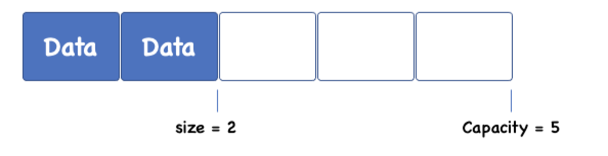
> 배열을 이용하여 만든 리스트
단방향 포인터 구조로 자료에 대한 순차적인 접근에 강점이 있어 조회가 빠르다.
순차적인 요소 추가/삭제는 빠르지만 임의의 위치에서 추가/삭제는 느린편이다.

> #### LinkedList
> 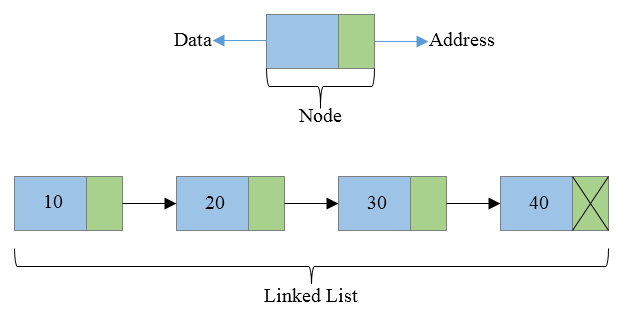
> 노드(객체)를 연결하여 리스트 처럼 만든 컬렉션이다.
ArrayList와 반대로 `양방향 포인터 구조`이며
데이터의 중간 삽입/삭제가 빠르지만 임의의 요소에 대한 접근이 느리다.
List와 Deque를 동시에 상속한다.

> #### Vector
> 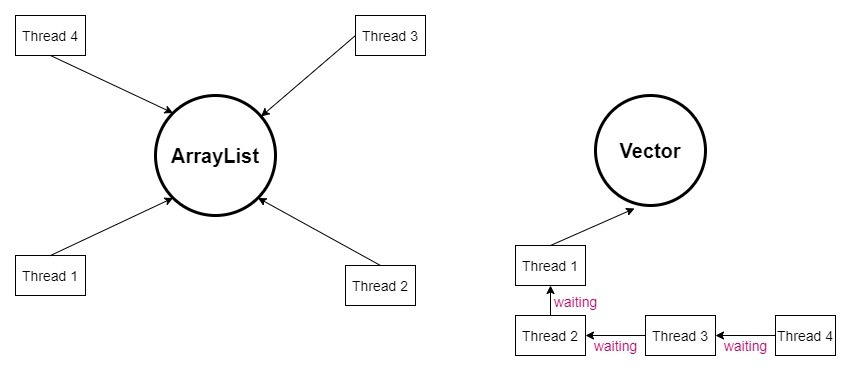
> ArrayList의 구형 버전 (구성이 거의 비슷)
ArrayList와 달리 메서드가 동기화 되어있어 Thread-Safe하다.

> #### Stack
> 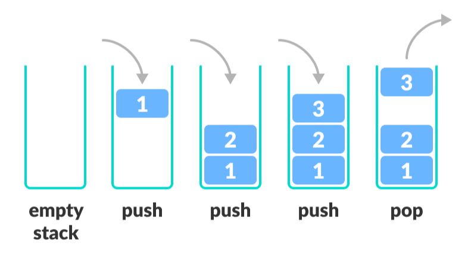
> 후입선출의 자료구조이다.
마지막에 들어온 원소가 처음으로 나간다.
값을 넣을때 push, 빼낼때 pop을 사용한다.
Vector를 상속하며 대체제로 ArratDeque를 많이 사용한다.

### Queue
선입선출의 자료 구조이다.

처음 들어온 원소가 처음으로 나간다.

> #### PriorityQueue
> 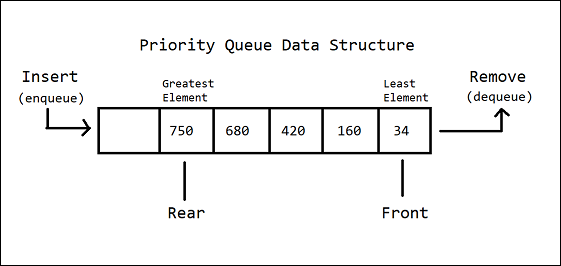
> 우선순위를 가지는 큐이다.
우선순위가 높은 순으로 정렬하고 꺼낸다.
우선순위 큐에 저장할 객체는 `compareTo`메서드를 사용해 객체의 우선순위를 결정하므로 `Comparable`인터페이스를 구현해야 한다.

> #### Deque
> 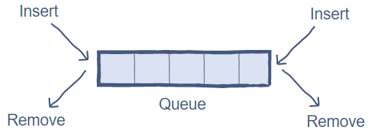
Deque(Double-Ended Queue)는 양쪽으로 넣고 빼는 것이 가능한 큐를 말한다.
스택과 큐를 하나로 합쳐놓은 것과 같다.

> > #### ArrayDeque
> > 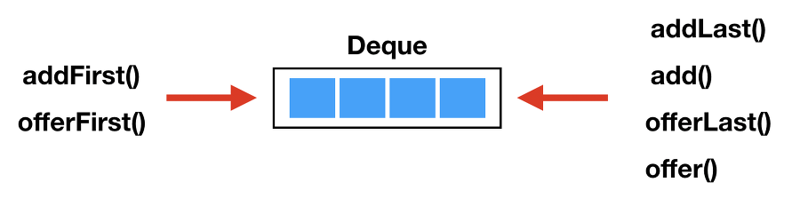
> > 스택으로 사용할 때 Stack 클래스보다 빠르며, 대기열로 사용할 때는 LinkedList보다 빠르다.

### Set
데이터의 중복과 순서가 없는 데이터의 집합이다.

순서가 없으므로 get(index) 메서드도 없다.

> #### HastSet
> 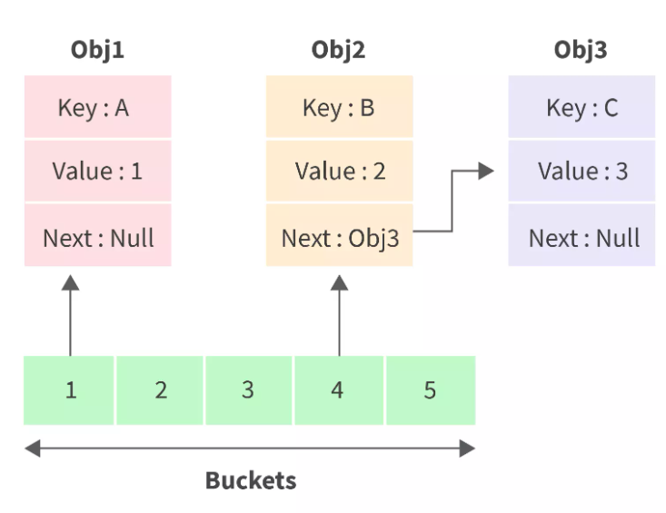
> 배열과 연결 노드를 결합한 자료구조이다.
추가, 검색, 삭제, 접근성이 모두 뛰어나다.
대신 순서를 예측 할 수 없다.

> #### LinkedHashSet
> 순서를 가지는 HashSet
추가된 순서, 최근에 접근한 순서대로 접근 할 수 있다.
중복 제거와 순서 유지를 동시에 하고 싶은 경우 `HastSet`의 대체제로 사용된다.

> #### HashSet
> 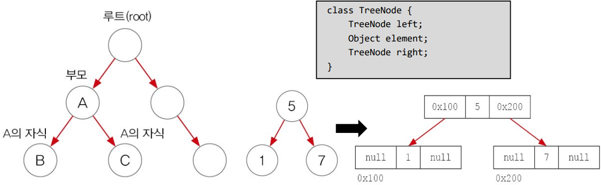
> 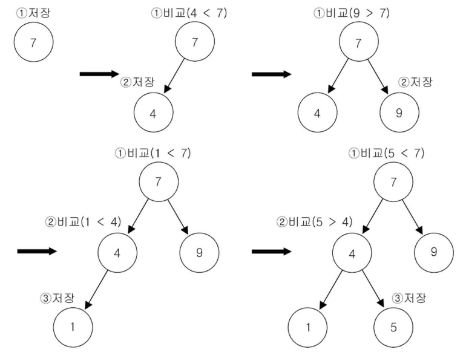
> 이진 검색 트리 형태의 자료구조이다.
순서를 가지지 않지만, 데이터를 정렬하여 저장한다.

> #### EnumSet
> EnumVisit Website 클래스와 함께 동작하는 Set 컬렉션이다.
중복되지 않는 상수 그룹을 나타내는데 사용한다.
추상 클래스이며 64개 미만 원소수를 가지면 `RegularEnumSet`,
그 이상이면 `JumboEnumSet`을 사용한다.

### Map

키(Key)와 값(value)의 쌍으로 연관지어 이루어진 데이터의 집합이다.

값은 중복될 수 있지만, 키는 중복 될 수 없다.

같은 키값에 값을 할당하려 시도하면 기존 값을 새 값으로 대체된다.

따라서 `keySet()`은 Set을 반환하고 `values()`는 Collection을 반환한다.

> #### HashMap
> 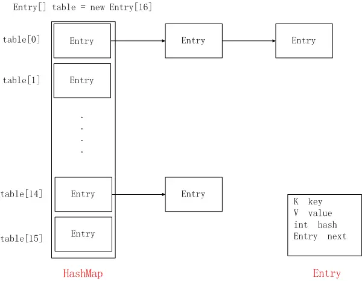
> HashTable을 보완한 컬렉션
배열과 연결이 결합된 형태로, 키(key)와 값(value)을 묶어 하나의 데이터로 저장한다.
비동기로 작동하기 때문에 멀티 쓰레드 환경에서는 ConcurrentHashMap을 사용하는 것이 권장된다.

> #### LinkedHashMap
> 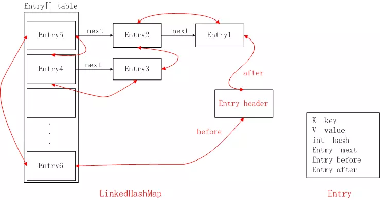
> HashMap을 상속하여, HashMap과 비슷하다.
하지만 Entry들이 연결되어 데이터의 순서를 보장한다.

> #### TreeMap
> 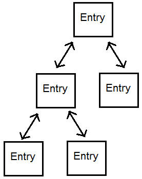
> 이진 검색 트리의 형태로 키와 값의 쌍으로 이루어진 데이터를 저장한다. 
(TreeSet 과 같은 원리)
TreeMap은 SortedMap 인터페이스를 구현하고 있어 Key 값을 기준으로 정렬된다.
정렬된 순서로 빠른 검색이 가능하지만, 키와 값을 저장하는 동시에 정렬을 실행하므로, 저장시간이 오래 걸린다.
정렬되는 순서는 숫자 > 알파벳 대문자 > 알파벳 소문자 > 한글 순이다.

> #### HashTable
> 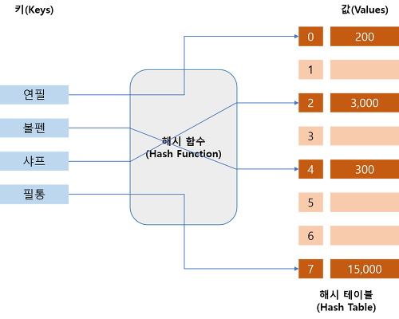
> Key를 특정 해시 함수를 통해 해싱한 후 나온 결과를 배열의 인덱스로 사용하여 Value를 찾는 방식으로 동작된다.
HashMap보다 느리지만, 동기화가 지원된다.