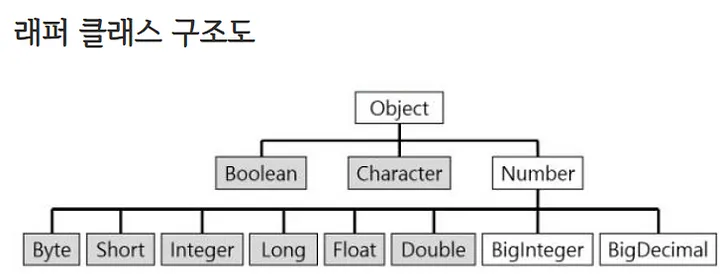

# Wrapper Class (래퍼 클래스)

기본 데이터 타입(원시타입)을 객체(참조타입)로 표현해야 할때 사용한다.
> ex) 컬렉션 프레임 워크에 값을 저장할 때

기본 데이터 타입을 클래스로 감싼 형태.

> ### 원시타입? 참조타입?
> 원시 타입은 string, int, short와 같이 값, 그 자체를 가진 자료형이고,
참조 타입은 그 값을 가르키는 주소를 나타낸다. 따라서 참조 타입을 사용할 때마다
실제로 메모리에 저장된 값을 불러오는 과정이 필요하다.

+ 원시 타입, 참조 타입의 실제 값(인스턴스)는 힙에 저장된다.
+ 참조 타입(주소)는 스택에 저장된다.



> 박싱 : 기본타입의 데이터 -> 래퍼 클래스의 인스턴스로 변환하는 과정이다

> 언박싱 : 래퍼 클래스의 인스턴스에 저장된 값 -> 기본 타입의 데이터로 꺼내는 과정이다

```java
// 박싱
// Integer 래퍼 클래스 wrappedNum 에 12 의 값을 저장
Integer wrappedNum = new Integer(12);

// 언박싱
// 래퍼 클래스 wrappedNum 의 값을 꺼내 가져온다.
int unboxedNum = wrappedNum.intValue();
```

JDK 1.5부터 자동적으로 박싱과 언박싱을 지원하기 시작했다.
```java
//오토박싱
Integer num = 21;

// 오토 언박싱
int n = num;
```

___

### 사용 이유

+ 메소드에 전달된 인수를 수정하려는 경우 오브젝트가 필요하다.
값의 변경 VS 참조에 의한 변경
+ java.util 패키지에서 객체만 처리하므로 Wrapper class가 필요하다.
(collection framework 포함)