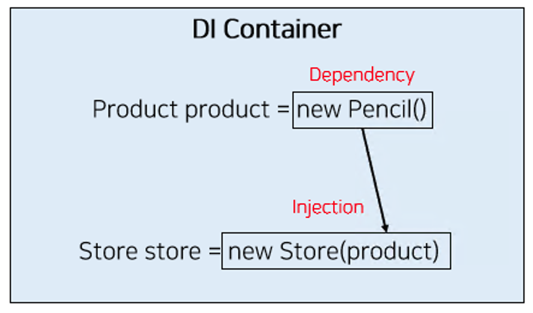

# Dependency Injection

두 객체간의 관계를 결정하는 디자인 패턴이다.

객체가 필요한 것은 외부에서 전달해주는 것이다.

생성자 주입, 필드 주입, 수정자 주입 등 다양한 주입 방법이 있다.

Spring 4부터는 생성자 주입을 강력히 권장하고 있다.


```java
public class Store {
  private Pencil pencil;
  public Store(){
    this.pencil = new Pencil()
  }
}
```

위 코드에서 Store와 Pencil은 강하게 결합되어있고
비효율적이며, pencil을 재사용할수 없다.

```java
public interface Product {}

public class Pencil implements Product {}

public class Store {

    private Product product;

    public Store(Product product) {
        this.product = product;
    }

}
```

이렇게 사용하면 결합도를 낮추고, 유연하게 외부에서 의존성을 주입받을 수 있다.




또한 스프링 컨테이너에서 싱글톤으로 의존성을 주입하면 불필요한 객체의 생성과 소멸을 줄일 수 있다.

// 싱글톤 -> 빈이 여러번 요청될때, 하나의 동일한 빈을 돌려준다.